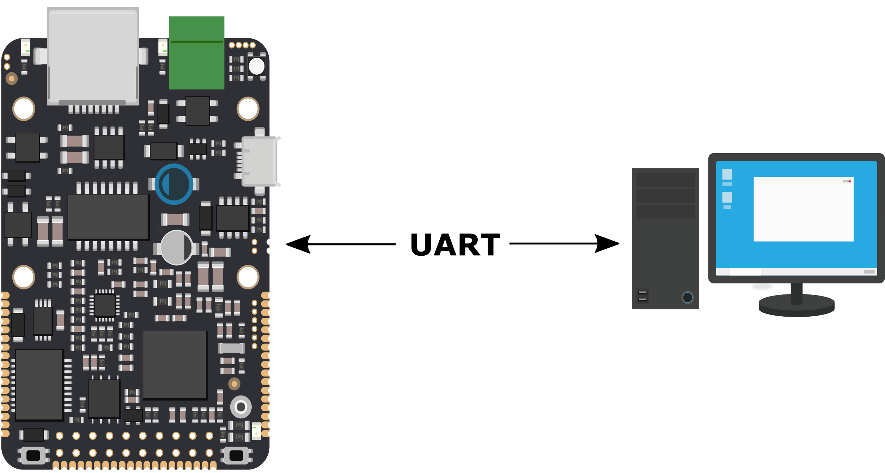

# Komunikace po sériové lince \(UART\) s PC

  
V řadě aplikací je potřebné zavést komunikační kanál mezi zařízením, které programujeme a PC. To je potřeba primárně za účelem debugování a logování nebo také v případě obsluhy zařízení v [command režimu](../../architektura-fw/bootloader/command-mod.md). Pro tyto účely se využívá sériová linka, kterou lze velmi jednoduše nakonfigurovat. 




## Konfigurace PC

Abychom mohli v PC zobrazovat zprávy přijaté po sériové lince, je nutné nakonfigurovat libovolný sériový terminál. Více informací o instalaci terminálu lze získat v sekci [Konfigurace sériové linky v PC](konfigurace-pc.md)



##  Programování sériové linky

Na straně zařízení se sériová komunikace obsluhuje přímo v programu a je možné ji inicializovat dvěma způsoby. Buď můžeme využít třídy [Serial](untitled.md#komunikace-pomoci-serial), nebo sériovou linku emulovat přes [microUSB](untitled.md#komunikace-pomoci-usb). Všechny potřebné informace se nacházejí v článku [Programování sériové linky](untitled.md).




Zde bude návod

* Jak zapojit sériovou linku \(stručně schéma s grafikou IODY! a stručně vysvětlit nebo odkázat někam kde je vysvětleno \)
* Vysvětlit makra SERIAL TX, SERIAL\_RX a jejich použití při komunikaci přes microUSB !! Vysvětlit, že pokud inicializuji jinou sériovou linku někde na pinech \(Krom Y00 a Y01\) tak nebude fungovat
* Krátký stručný kód

## Programování sériové linky

Konkrétní ukázky kódu pro komunikaci s počítačem je možné nalézt v sekcích [komunikace pomocí USB](https://github.com/byzance/public-documentation/tree/38b460c46404c197299c0f0a84e3402a9b74c8d7/byzance_documentation/hardware_intro/navody/pripojeni-k-pc/pomoci-usb.md) či [komunikace pomocí sériové linky](https://github.com/byzance/public-documentation/tree/38b460c46404c197299c0f0a84e3402a9b74c8d7/byzance_documentation/hardware_intro/navody/pripojeni-k-pc/pomoci-seriove-linky.md).

## Připojení k PC pomocí USB

Některá Byzance zařízení je možné připojit pomocí USB. USB je koncipováno především k tomu, aby nahradilo standardní sériovou linku, čímž odpadne nutnost použití převodníku s FTDI čipem. Všeobecné informace, jak zprovoznit komunikaci ze strany počítače jsou popsány v článku [Připojení k PC](https://github.com/byzance/public-documentation/tree/38b460c46404c197299c0f0a84e3402a9b74c8d7/byzance_documentation/hardware_intro/navody/pripojeni-k-pc.md). Nevýhoda je taková, že při každém restartu zařízení se USB odpojí a připojí k počítači a je třeba v ovládací aplikaci znovu otevřít COM port.

## Inicializace

Konstruktor USB linky může zůstat bez parametrů. V takovém případě se dosadí defaultní hodnoty. Nevýhodou může být to, že poslední parametr ''connect\_blocking'' je dosazen za ''true'', což znamená, že zařízení nepokračuje ve vykonávání kódu, dokud není připojeno USB a konstruktor je blokující. To může být v mnoha případech nežádoucí.

```cpp
USBSerial usb;
```

Vhodnější může být volba, aby USB konstruktor neblokoval kód, přičemž produktové kódy se musí dosadit do předchozích parametrů.

```cpp
USBSerial usb(0x1f00, 0x2012, 0x0001, false);
```

V případě USB se narozdíl od sériové linky nenastavuje baudová rychlost.

## Ukázkový kód

Velmi jednoduchý kód pro výpis ''hello world'' pomocí USB může vypadat například takto

```cpp
USBSerial usb;

void loop(){
   usb.printf("hello world\n");
   Thread::wait(500);
}
```

## Připojení k PC pomocí sériové linky

Sériová linka je poměrně standardní rozhraní využívané v oblasti mikrokontrolérů. Pro připojení se využívá [MBED-OS API](https://github.com/byzance/public-documentation/tree/38b460c46404c197299c0f0a84e3402a9b74c8d7/byzance_documentation/hardware_intro/API/mbed-api.md) pro [komunikační rozhraní](https://github.com/byzance/public-documentation/tree/38b460c46404c197299c0f0a84e3402a9b74c8d7/byzance_documentation/hardware_intro/API/mbed-api/komunikacni-rozhrani.md). Pro správnou funkčnost je třeba sériovou komunikaci [zprovoznit ze strany počítače](https://github.com/byzance/public-documentation/tree/38b460c46404c197299c0f0a84e3402a9b74c8d7/byzance_documentation/hardware_intro/navody/pripojeni-k-pc.md).

### Inicializace

Většina zařízení je vybavena více sériovými linkami, což je třeba specifikovat při inicializaci. Je nutné zjistit konkrétní piny, které disponují touto periferií. Tyto informace se dají zjistit v sekci [Hardware](https://github.com/byzance/public-documentation/tree/38b460c46404c197299c0f0a84e3402a9b74c8d7/Hardware/README.md) vždy pro konkrétní zařízení.

V konstruktoru se zadávají parametry pinů TX a RX.

```cpp
Serial pc(SERIAL_TX, SERIAL_RX);
```

Dále je třeba zvolit baudovou rychlost. K tomu je vyhrazena sekce init\(\). Baudová rychlost může být různá, záleží na uživateli a pohybuje se většinou v rozmezí 1200 - 230400 baud. Stejnou rychlost je třeba nastavit [na straně počítače při připojení](https://github.com/byzance/public-documentation/tree/38b460c46404c197299c0f0a84e3402a9b74c8d7/byzance_documentation/hardware_intro/navody/pripojeni-k-pc.md).

```cpp
pc.baud(115200);
```

### Ukázkový kód

Jednoduchý kód pro výpis ''hello word'' přes sériovou linku.

```cpp
#include "byzance.h"

Serial    pc(SERIAL_TX, SERIAL_RX);

void init(){
   pc.baud(115200);
}

void loop(){
   pc.printf("hello world\n");
   Thread::wait(500);
}
```




