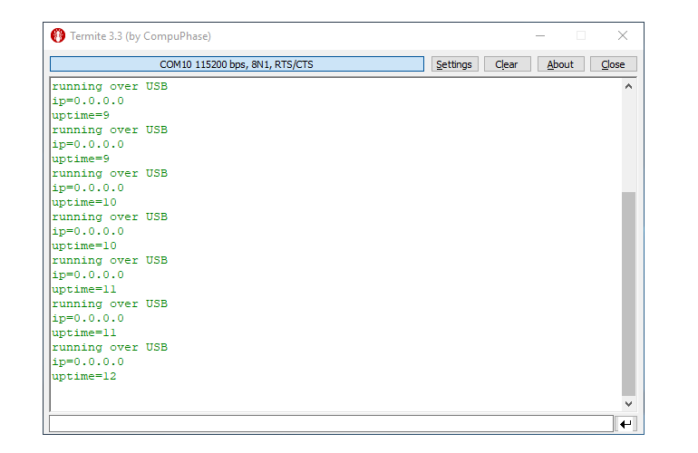

# Konfigurace sériové linky v PC

Zařízení lze k PC připojit pouze pokud je v zařízení IODAG3E spuštěný firmware, který má **sériovou linku inicializovanou**. Jak sériovou linku inicializovat v programu se lze dozvědět v sekci [Programování sériové linky](untitled.md). V případě, že provádíme nastavení zařízení v command režimu \(Zařízení je přepnuto v bootloaderu\), sériová linka je inicializována automaticky.

### Konfigurace na Windows

Po připojení zařízení IodaG3E k PC se zařízení přihlásí jako nový COM port. Seznam těchto portů je možné získat ve správci zařízení \(**Ovládací panely -&gt; Hardware a zvuk -&gt; Správce zařízení**\) Je-li zařízeních víc, číslo konkrétního lze zjistit například tak, že se zařízení několikrát fyzicky připojí a odpojí a přitom se jeho číslo objeví v seznamu a zase zmizí.

V případě, že se nový COM port po připojení zařízení neobjeví, není buď inicializována sériová linka v programu zařízení IODA, nebo je třeba nainstalovat jeho ovladač \(Windows 7 a Windows 10 by toto měly udělat automaticky\). Dále je třeba mít nainstalovaný terminálový program. Tím může být například [Termite](https://www.compuphase.com/software_termite.htm), [Hercules](http://www.hw-group.com/products/hercules/index_cz.html) a mnoho jiných.

Zvolený COM port je třeba nastavit v terminálu společně s ukončováním řádků CR-LF, zvolenou rychlostí BAUD, data bits 8, stop bit 1 a žádnou paritou. USB driver vyžaduje zapnutí flow control na RTS/CTS.

Po potvrzení nastavení je možné se zařízením začít komunikovat kliknutím na tlačítko **Disconnected - click to connect**.

