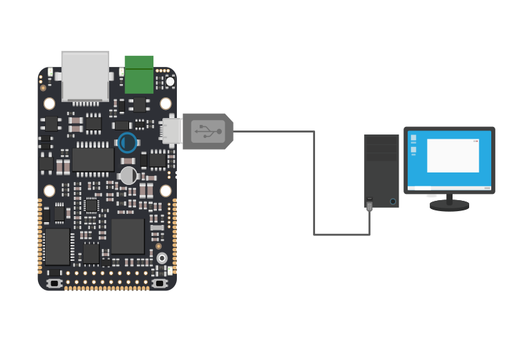
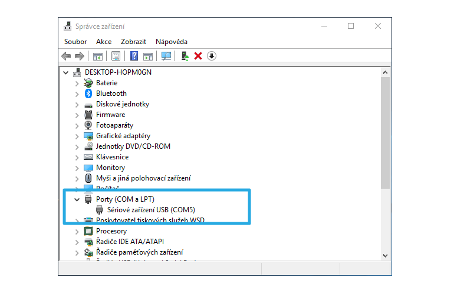
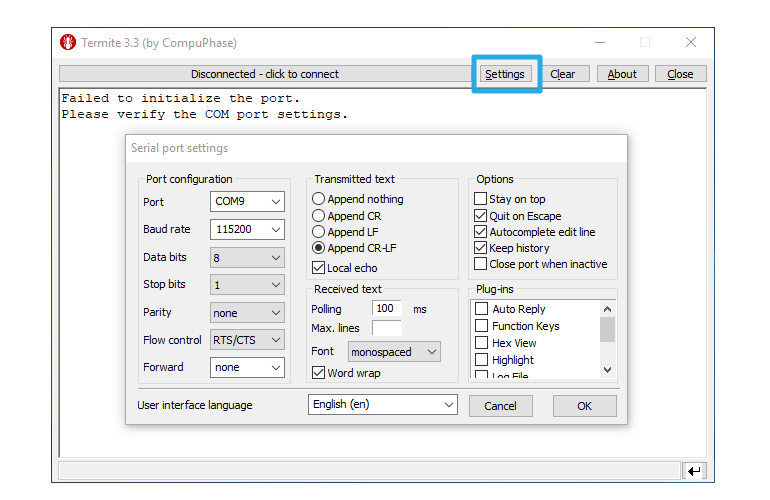
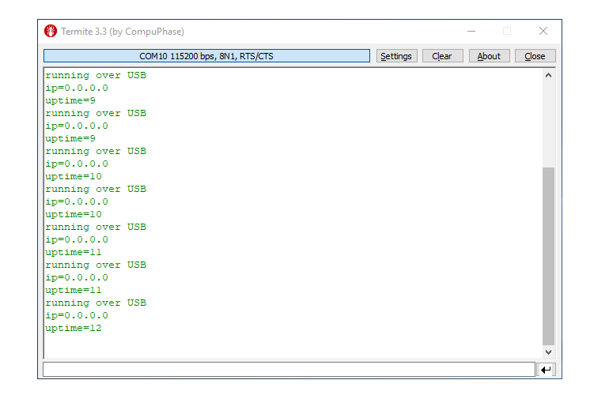
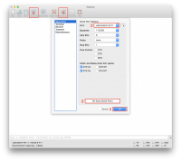
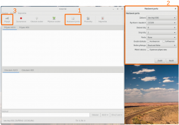

# Připojení zařízení k PC

Se zařízením IODAG3E lze komunikovat z PC pomocí sériové linky. To je užitečné například při nastavování zařízení v [command režimu](https://github.com/byzance/public-documentation/tree/38b460c46404c197299c0f0a84e3402a9b74c8d7/articles/hardware/ioda/navody/bootloader.md), debugování, nebo logování do PC.

Zařízení je možné připojit **pomocí USB**, kdy je sériová linka softwarově emulována přímo v IODAG3E

nebo pomocí převodníku **TTL/USB**,

## Konfigurace sériového linky v PC

Zařízení lze k PC připojit pouze pokud je v zařízení IODAG3E spuštěný firmware, který má **sériovou linku inicializovanou**. Jak sériovou linku inicializovat v programu se lze dozvědět v sekci [Komunikace po sériové lince](komunikace-po-seriove-lince-uart/). V případě, že provádíme nastavení zařízení v command režimu \(Zařízení je přepnuto v bootloaderu\), sériová linka je inicializována automaticky.

### Konfigurace na Windows

Po připojení zařízení IodaG3E k PC se zařízení přihlásí jako nový COM port. Seznam těchto portů je možné získat ve správci zařízení \(**Ovládací panely -&gt; Hardware a zvuk -&gt; Správce zařízení**\) Je-li zařízeních víc, číslo konkrétního lze zjistit například tak, že se zařízení několikrát fyzicky připojí a odpojí a přitom se jeho číslo objeví v seznamu a zase zmizí.

V případě, že se nový COM port po připojení zařízení neobjeví, není buď inicializována sériová linka v programu zařízení IODA, nebo je třeba nainstalovat jeho ovladač \(Windows 7 a Windows 10 by toto měly udělat automaticky\). Dále je třeba mít nainstalovaný terminálový program. Tím může být například [Termite](https://www.compuphase.com/software_termite.htm), [Hercules](http://www.hw-group.com/products/hercules/index_cz.html) a mnoho jiných.

Zvolený COM port je třeba nastavit v terminálu společně s ukončováním řádků CR-LF, zvolenou rychlostí BAUD, data bits 8, stop bit 1 a žádnou paritou. USB driver vyžaduje zapnutí flow control na RTS/CTS.

Po potvrzení nastavení je možné se zařízením začít komunikovat kliknutím na tlačítko **Disconnected - click to connect**.

### Konfigurace sériové linky na MAC

Nové zařízení se v případě macOS přihlašuje přes porty s názvem "usbmodem" pro USB nebo "usbserial" pro sériovou linku. Pro snadné připojení je nejdříve vhodné nainstalovat utilitu // utilita coolterm. V odkazovaném ZIP souboru je jak samotný program DMG a konfigurační soubor \*\*Yoda.stc\*\*.

Po nainstalování utility \*\*CoolTerm\*\* a spuštění konfiguračního souboru \*\*Yoda.stc\*\* je vhodné postupovat v následujících pěti krocích \(viz přiložený screenshot\):

* Stiskněte tlačítko Options v horním menu
* Re-Scanujte dostupné sériové porty
* Zvolte port "usbmodemXXXXX"/"usbserialXXXX" \(měl by být jediný\)
* Potvrďte stisknutím "OK"
* Stiskněte tlačítko "Connect" v horním menu

Nyní by se měl vypisovat log do okna aplikace.

V případě přepnutí na Bootloader v zařízení Yoda není nutné měnit port.

### Konfigurace sériové linky na Linux

Připojením zařízení k PC je v adresáři ''/dev/'' vytvořen soubor ''ttyUSBx'' nebo ''ttyACMx'', kde ''x'' je číslo. Výpis zařízení je tedy možné zobrazit pomocí správce souborů nebo příkazu ''ls /dev/tty\*''.

Jako komunikační terminál lze použít například cutecom či moserial.

Na některých distribucích je nutné přidat uživatele do skupiny dialout pro přístup k sériovému portu. To je možné učinit příkazem

''sudo adduser už\_jméno dialout''.

