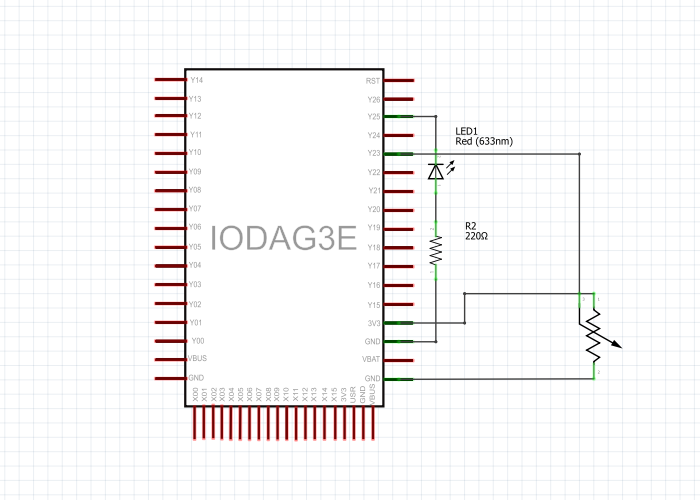

# Analog Read Serial

Tento příklad znázorňuje, jak zjistit analogovou hodnotu napětí pomocí zařízení IODA. Jako příklad budeme pomocí této hodnoty pozorovat pozici otočení potenciometru. Toto natočení budeme monitorovat pomocí sériové linky v PC

## Analogový vstup

Zařízení IODA je vybavené ADC převodníky a na některých svých vstupech konektoru XY je schopné snímat analogovou hodnotu napětí a interpretovat tuto hodnotu číslem v programu. Hodnota tohoto vstupního napětí musí být v rozsahu **0-3.3V** a lze ji interpretovat několika způsoby. Buď jí lze interpretovat hodnotou **float**, která reprezentuje rozsah vstupního napětí desetiným číslem **0-1**, nebo jí lze interpretovat celočíselným 16ti-bitovým číslem \(uint16\_t\). Více o Analogovém vstupu se lze dozvědět v sekci [Vstupy a výstupy](../../programovani-hw/mbed-api/vstupy-a-vystupy.md#analogin). 

## Hardware

* 10kΩ potenciometr
* IODA
* LED
* 220Ω rezistor

## Obvod

Pro přípojení potenciometru se použijí 3 vodiče. První vychází z vnějšího pinu potenciometru na zem. Druhá část vychází z druhého vnějšího pinu na 3.3 voltu. Třetí vychází ze středního pinu potenciometru na analogový pin Y25. Pro zapojení LED se použijí 2 vodiče a jeden 100Ω rezistor.


## Schéma




## Code

```cpp
  /**AnalogOutInSerial
    * Reads an analog input pin, maps the result to a range from 0 to 1 and uses
    * the result to set the pulse width modulation (PWM) of an output pin.
    * Also prints the results to the Serial Monitor.
    */

#include "byzance.h"   // Include libraries for IODA.

Serial pc(SERIAL_TX, SERIAL_RX);   // Defines the comunication interface if the serial line , SPI, CAN is needen in the program.

AnalogOut aout(Y25);   

AnalogIn ain(Y23);

// the init routine runs only once when you press reset:
void init(){


  pc.baud(115200);   // set baud rate.
}
// the loop routine runs over and over agin forever:
void loop(){ 

  pc.printf("ain value =%3.3f%%\n",ain.read());

  aout=ain; 

  Thread::wait(100);   // Wait for 100ms.

}
```

Tato funkce slouží k definici sériového rozhraní a komunikaci po sériové lince. Ke komunikaci jsou zapotřebí dva piny - RX\(recieve data\) a TX\(transfer data\).

```cpp
 Serial pc(SERIAL_TX, SERIAL_RX);
```

 V hlavičce programu je nutné importovat knihovny [Byzance Hardware API](https://docu.byzance.cz/hardware-a-programovani/programovani-hw/byzance-api) a [Mbed API](https://docu.byzance.cz/hardware-a-programovani/programovani-hw/mbed-api). pomocí

```cpp
 #include "byzance.h"
```

### Analogový vstup \(AnalogIn\)

Převede napětí na pinu analogového vstupu v rozmezí 0 - 3.3V do digitální podoby a interpretuje ho číslem na škále 0-4095. Rozlišení převodníku je 2.44 mV.

```cpp
 AnalogIn ain(pin_name);
printf(”ain value = %3.3f%%\n”, ain.read());
```

### Analogový výstup \(AnalogOut\)

Funkce AnalogOut umožňuje definovat analogový výstup, který pomocí digitáně analogového převodníku dokáže na základě vstupní hodnoty této funkce měnit hodnotu napětí na výstupním pinu v rozsahu 0 - 3.3V . Procesor umožňuje definovat dva analogové výstupy, a to na pinech Y23 a Y25. Velikost napětí na výstupu je škálováno zápisem v rozsahu 0 - 1, kdy 1 je maximální napětí 3.3V.

```cpp
 //Definice analogového výstupu na pinu Y25
AnalogOut aout(Y25);

// Nastavení maximálního napětí
aout = 1.0f;

// Nastavení poloviny VCC
aout = 0.5f; 

// Čtení aktuální hodnoty napětí na 
aout.read();
```

Funkce `init()` se vyvolá při spuštění.Používa se pro inicializaci proměnných, pinových režimů apod. Funkce se spustí pouze jednou při spuštění nebo resetování desky.

Funkce `loop()` se spustí až po funkci `init()` a opakuje se neustále dokola, což dovolí program měnit a kontrolovat za běhu. Používá se pro akční kontrolu desky.

Jakýkoliv řádek, který začíná dvěma lomítky\(//\), kompilátor nečte, tudíž slouží k okomentování části programu, nebo-li pro vysvětlení co danná část kodu dělá.

```cpp
 void init{
    // nastavení programu, spustí se pouze jednou
 } 


 void loop{
    // hlavní program, opakuje se neustále dokola
}
```

K vypsání načtených hodnot z potenciometru používáme `pc.printf("");`

```cpp
 pc.printf("ain value =%3.3f%%\n",ain.read());
```

 V poslední části kódu je vlákno programu uspáno na 100 milisekund.

```cpp
 Thread::wait(100);
```


