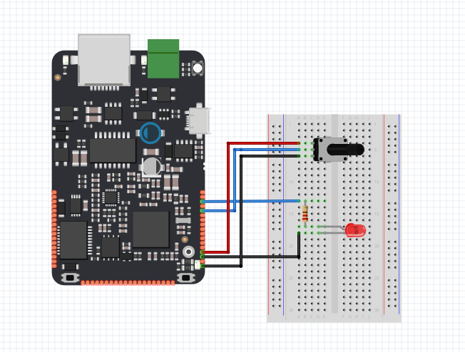

# Analog Read/Write

Tento příklad znázorňuje, jak vyčíst analogovou hodnotu napětí pomocí zařízení IODAG3E. Jako příklad budeme pomocí této hodnoty pozorovat pozici otočení potenciometru. Toto natočení budeme monitorovat pomocí sériové linky v PC. Taktéž budeme měnit hodnotu napětí na LED a tím ji stmívat.

## Použitý hardware

* IODAG3E
* 10kΩ potenciometr
* LED
* 220Ω rezistor

## Schéma zapojení

Potenciometr zapojíme tak abychom vytvořili jednoduchý dělič napětí. Potenciometr zapojíme mezi pin 3V3 a GND. Jezdec potenciometru poté zapojíme na pin Y23, který dokáže pracovat jako analogový vstup. LED poté připojíme k pinu Y25, který naopak dokáže pracovat jako analogový výstup viz [Analogové vstupy](../../hardware/zakladni-jednotky/iodag3e/rozhrani-a-periferie.md#analogove-vstupy) a [Analogové výstupy](../../hardware/zakladni-jednotky/iodag3e/rozhrani-a-periferie.md#analogove-vystupy).





## Funkce

Zařízení IODA je vybavené ADC převodníky a na některých svých vstupech konektoru XY je schopné snímat analogovou hodnotu napětí a interpretovat tuto hodnotu číslem v programu. Hodnota tohoto vstupního napětí musí být v rozsahu **0-3.3V** a lze ji interpretovat několika způsoby. Buď jí lze interpretovat hodnotou **float**, která reprezentuje rozsah vstupního napětí desetiným číslem **0-1**, nebo jí lze interpretovat celočíselným 16ti-bitovým číslem \(uint16\_t\). Více o Analogovém vstupu se lze dozvědět v sekci [Vstupy a výstupy](../../programovani-hw/mbed-api/vstupy-a-vystupy.md#analogin). Následující kód převede vstupní hodnotu napětí, která je závislá na otočení potenciometru, do digitální podoby a nastaví pomocí ní výstupní hodnotu napětí na LED diodě. Otáčením tedy můžeme LED diodu stmívat a rozsvěcet. 

## Code

```cpp
  /**AnalogOutInSerial
    * Reads an analog input pin, maps the result to a range from 0 to 1 and uses
    * the result to set the pulse width modulation (PWM) of an output pin.
    * Also prints the results to the Serial Monitor.
    */
#include "byzance.h"   // Include libraries for IODA.
Serial pc(SERIAL_TX, SERIAL_RX);   // Defines the comunication interface if the serial line , SPI, CAN is needen in the program.

AnalogOut aout(Y25);   
AnalogIn ain(Y23);
// the init routine runs only once when you press reset:
void init(){
  pc.baud(115200);   // set baud rate.
}
// the loop routine runs over and over agin forever:
void loop(){ 
  pc.printf("ain value =%3.3f%%\n",ain.read());
  aout=ain; 

  Thread::wait(100);   // Wait for 100ms.

}
```


 V hlavičce programu je nutné importovat knihovny [Byzance Hardware API](https://docu.byzance.cz/hardware-a-programovani/programovani-hw/byzance-api) a [Mbed API](https://docu.byzance.cz/hardware-a-programovani/programovani-hw/mbed-api). pomocí

```cpp
 #include "byzance.h"
```

 Poté nasleduje konstruktor definující objekt [sériové linky](https://docu.byzance.cz/hardware-a-programovani/tutorialy/komunikace-po-seriove-lince-uart-s-pc).

```cpp
 Serial pc(SERIAL_TX, SERIAL_RX);
```

## Analogový vstup \(AnalogIn\)

Převede napětí na pinu analogového vstupu v rozmezí 0 - 3.3V do digitální podoby a interpretuje ho číslem na škále 0-1. 

```cpp
 AnalogIn ain(pin_name);  // Analog input definition
printf(”ain value = %3.3f%%\n”, ain.read());
```

### Analogový výstup \(AnalogOut\)

Funkce AnalogOut umožňuje definovat analogový výstup, který pomocí digitáně analogového převodníku dokáže na základě vstupní hodnoty této funkce měnit hodnotu napětí na výstupním pinu v rozsahu 0 - 3.3V . Procesor umožňuje definovat dva analogové výstupy, a to na pinech Y23 a Y25. Velikost napětí na výstupu je škálováno zápisem v rozsahu 0 - 1, kdy 1 je maximální napětí 3.3V.

```cpp
AnalogOut aout(Y25);  // Analog output definition 

aout = 1.0f;   // Set maximum voltage to output (3,3V)
aout = 0.5f;   // Set half of maximum voltage to output (1,65V)

aout.read();   // Read voltage value set to output
```

Funkce `init()` se vyvolá při spuštění. Používa se pro inicializaci proměnných, pinových režimů apod. Funkce se spustí pouze jednou při spuštění nebo resetování desky. V tomto případě pouze inicializuje rychlost komunikace sériové linky.

```cpp
// the init routine runs only once when you press reset:
void init(){
  pc.baud(115200);   // set baud rate.
}
```

Funkce `loop()` je nekonečná smyčka, ve které se přečte hodnota napětí na jezdci potenciometru do proměnné **ain**. Tato hodnota se vypíše do sériové linky a nastaví se pomocí ní výstupní hodnota napětí na LED diodě \(**aout**\). 

```cpp
// the loop routine runs over and over agin forever:
void loop(){ 
  pc.printf("ain value =%3.3f%%\n",ain.read());
  aout=ain; 
  
 Thread::wait(100);
}
```

 V poslední části kódu je vlákno programu uspáno na 100 milisekund.

```cpp
 Thread::wait(100);
```


