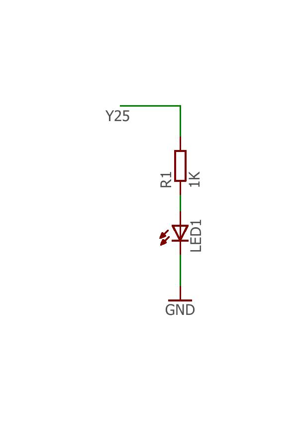

# Blink Without Delay

Někdy je v programu potřeba udělat dvě věci najednou. Proto nelze použít funkci `Thread::wait()`. K vyřešení tohoto konkrétního problému lze použít funkci `Timer`\|`Ticker`\(časovač\)

## Použitý hardware

* IODA
* 220Ω rezistor
* LED

## Schéma zapojení

Pro sestavení obvodu připojte jeden konec odporu na pin Y25 na desce. Připojte dlouhý konektor LED \(kladný konektor nazvaný anoda\) na druhý konec odporu. Připojte krátký konektor LED \(negativní konektor, nazývanou katodou\) k desce GND, jak je znázorněno na výše uvedeném schématu a schématu níže.




### Funkce 

 Tento program bliká připojenou LED diodou bez toho aby omezoval hlavní vlákno.

## Code

### 1.možnost programu\(Timer\)

```cpp
   /**BlinkWithoutDelay
     *Turns on and off a light emitting diode (LED) connected to a digital pin,
     *without using the delay() function. This means that other code can run at the
     *same time without being interrupted by the LED code.
     */


#include "byzance.h"   // Include libraries for IODA
DigitalOut ledPin(X01);   // Set pin Y25 for led.
Serial pc(SERIAL_TX, SERIAL_RX);   // Defines the comunication interface if the serial line , SPI, CAN is needen in the program.
Timer casovac;
void init(){   // The init routine runs only once when you press reset.
    pc.baud(115200);   // Set baud rate.
    casovac.start();
}
void loop(){
    if(casovac.read()>2){
        ledPin=!ledPin;
        casovac.reset();
    }
}
```


V hlavičce programu je nutné importovat knihovny [Byzance Hardware API](../../programovani-hw/byzance-api/) a [Mbed API](../../programovani-hw/mbed-api/). pomocí 

```cpp
#include "byzance.h"
```

Poté nasledují tři konstruktory definující objekt [sériové linky](../komunikace-po-seriove-lince-uart-s-pc/) ,[digitálního výstupu](../../programovani-hw/mbed-api/vstupy-a-vystupy.md) a objekt [timer](../../programovani-hw/mbed-api/casovani.md#timer).

```cpp
Serial pc(SERIAL_TX, SERIAL_RX); 
DigitalOut LedPin(X01);   // Set the digital output pin.
Timer casovac;
```

Při každém spuštění programu se nejprve provede funkce _**init\(\)**,_ která primárně slouží k inicializaci všech objektů a proměnných.V tomto programu pouze inicializujeme rychlost sériové linky a spustíme časovač.

```cpp
void init(){   // The init routine runs only once on the begin of the program
  pc.baud(115200);   // Set baud rate.
  casovac.start();
}
```

V hlavní části programu je pouze podmínka if která se splní pokud časovač načte hodnotu větší než 2s.  
Jestliže podmínka proměnná **ledPin** změní svojí stávající hodnotu a časovač se restartuje.

```cpp
void loop(){
    if(casovac.read()>2){
        ledPin=!ledPin;
        casovac.reset();
    }
}
```

### 2.možnost programu\(Ticker\)

```cpp
   /**BlinkWithoutDelay
     *Turns on and off a light emitting diode (LED) connected to a digital pin,
     *without using the delay() function. This means that other code can run at the
     *same time without being interrupted by the LED code.
     */

#include "byzance.h"   // Include libraries for IODA
DigitalOut ledPin(X01);   // Set pin Y25 for led.
Serial pc(SERIAL_TX, SERIAL_RX);   // Defines the comunication interface if the serial line , SPI, CAN is needen in the program.
Ticker casovac;
void led(){
    ledPin=!ledPin;
}
void init(){   // The init routine runs only once when you press reset.
    pc.baud(115200);   // Set baud rate.
    casovac.attach(led,2);

}
void loop(){
}
```


V hlavičce programu je nutné importovat knihovny [Byzance Hardware API](../../programovani-hw/byzance-api/) a [Mbed API](../../programovani-hw/mbed-api/). pomocí

```cpp
#include "byzance.h"
```

Poté nasledují tři konstruktory definující objekt [sériové linky](../komunikace-po-seriove-lince-uart-s-pc/) ,[digitálního výstupu](../../programovani-hw/mbed-api/vstupy-a-vystupy.md) a objekt [ticker](../../programovani-hw/mbed-api/casovani.md#ticker).

```cpp
Serial pc(SERIAL_TX, SERIAL_RX); 
DigitalOut LedPin(X01);   // Set the digital output pin.
Ticker casovac;
```

V hlavičce programu taktéž založíme funkci **led**. Kterou budeme dále v programu vyvolávat.  
Ve funkci se pouze mění hodnota proměnné **ledPin**.

```cpp
void led(){
    ledPin=!ledPin;
}
```

Při každém spuštění programu se nejprve provede funkce _**init\(\)**,_ která primárně slouží k inicializaci všech objektů a proměnných.Zde inicializujeme rychlost sériové linky a zjišťujeme zda časovač dosahl hodnoty 2s., pokud ano vyvolá se již zmiňovaná funkce **led.**

```cpp
void init(){   // The init routine runs only once on the begin of the program
  pc.baud(115200);   // Set baud rate.
  casovac.attach(led,2);
}
```

