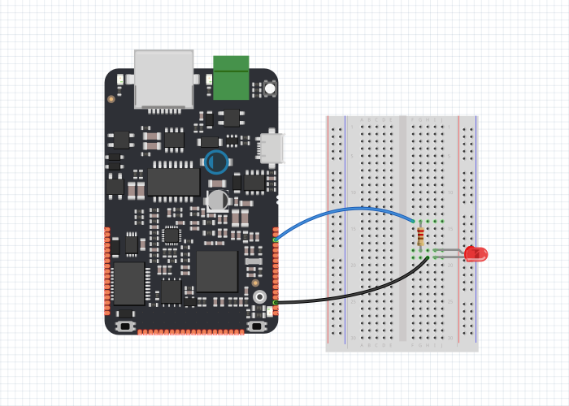
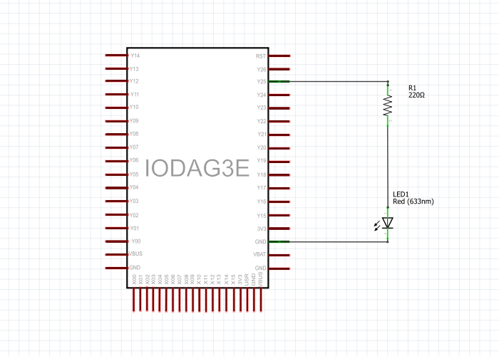

# Blink Without Delay

Někdy je v programu potřeba udělat dvě věci najednou. Proto nelze použít funkci `Thread::wait()`. K vyřešení tohoto konkrétního problému lze použít funkci `Timer` .Která az provést.

## Hardware

* IODA
* 220Ω rezistor
* LED

## Obvod

Pro sestavení obvodu připojte jeden konec odporu na pin Y25 na desce. Připojte dlouhý konektor LED \(kladný konektor nazvaný anoda\) na druhý konec odporu. Připojte krátký konektor LED \(negativní konektor, nazývanou katodou\) k desce GND, jak je znázorněno na výše uvedeném schématu a schématu níže.



## Schematic



## Code

1.možnost programu

```cpp
   /**BlinkWithoutDelay
     *Turns on and off a light emitting diode (LED) connected to a digital pin,
     *without using the delay() function. This means that other code can run at the
     *same time without being interrupted by the LED code.
     */


#include "byzance.h"   // Include libraries for IODA
DigitalOut ledPin(X01);   // Set pin Y25 for led.
Serial pc(SERIAL_TX, SERIAL_RX);   // Defines the comunication interface if the serial line , SPI, CAN is needen in the program.
Timer casovac;
void init(){   // The init routine runs only once when you press reset.
    pc.baud(115200);   // Set baud rate.
    casovac.start();
}
void loop(){
    if(casovac.read()>2){
        ledPin=!ledPin;
        casovac.reset();
    }
}
```

2.možnost programu

```cpp
   /**BlinkWithoutDelay
     *Turns on and off a light emitting diode (LED) connected to a digital pin,
     *without using the delay() function. This means that other code can run at the
     *same time without being interrupted by the LED code.
     */

#include "byzance.h"   // Include libraries for IODA
DigitalOut ledPin(X01);   // Set pin Y25 for led.
Serial pc(SERIAL_TX, SERIAL_RX);   // Defines the comunication interface if the serial line , SPI, CAN is needen in the program.
Ticker casovac;
void led(){
    ledPin=!ledPin;
}
void init(){   // The init routine runs only once when you press reset.
    pc.baud(115200);   // Set baud rate.
    casovac.attach(led,2);

}
void loop(){
}
```

