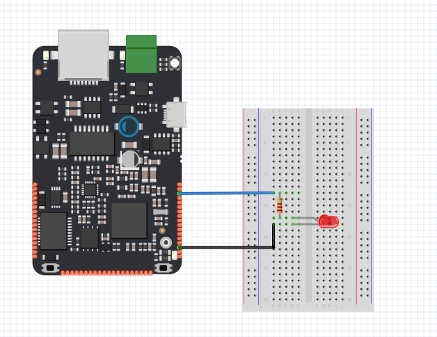

# Timer/Ticker

Tento tutoriál demonstruje použití dvou důležitých funkcionalit \(Timeru a Tickeru\), které lze využít k přesnému časování periodických i aperiodických událostí, bez toho abychom ovlivnili program vykonávaný v hlavním vlákně `loop()`.

## Použitý hardware

* IODAG3E
* 1kΩ rezistor
* LED

## Schéma zapojení

 [Anoda](https://cs.wikipedia.org/wiki/LED#/media/File:%2B-_of_LED_2.svg) LED je zapojena na pin X01. [Katoda](https://cs.wikipedia.org/wiki/LED#/media/File:%2B-_of_LED_2.svg) je přes resistor 1kΩ připojena k zemi \(pinu GND\).




### Funkce 

Následující program bliká LED diodou určitou frekvencí bez toho abychom omezili hlavní vlákno, můžeme přistupovat dvěma způsoby. První způsob je použít Timer \(Časovač\), který lze spustit a pozorovat překročení dané doby. Druhým způsobem je využít Ticker, který cyklicky danou dobu volá zadanou funkci.

## Code 

### 1. Program s Timerem

```cpp
   /**BlinkWithoutDelay
     *Turns on and off a light emitting diode (LED) connected to a digital pin,
     *without using the delay() function. This means that other code can run at the
     *same time without being interrupted by the LED code.
     */


#include "byzance.h"   // Include libraries for IODA
DigitalOut ledPin(X01);   // Set pin Y25 for led.
Serial pc(SERIAL_TX, SERIAL_RX);   // Defines the comunication interface if the serial line , SPI, CAN is needen in the program.
Timer casovac;
void init(){   // The init routine runs only once when you press reset.
    pc.baud(115200);   // Set baud rate.
    casovac.start();
}
void loop(){
    if(casovac.read()>2){
        ledPin=!ledPin;
        casovac.reset();
    }
}
```


V hlavičce programu je nutné importovat knihovny [Byzance Hardware API](../../programovani-hw/byzance-api/) a [Mbed API](../../programovani-hw/mbed-api/). pomocí 

```cpp
#include "byzance.h"
```

Poté nasledují tři konstruktory definující objekt [sériové linky](../komunikace-po-seriove-lince-uart-s-pc/) ,[digitálního výstupu](../../programovani-hw/mbed-api/vstupy-a-vystupy.md) a objekt [timer](../../programovani-hw/mbed-api/casovani.md#timer).

```cpp
Serial pc(SERIAL_TX, SERIAL_RX); 
DigitalOut LedPin(X01);   // Set the digital output pin.
Timer casovac;
```

Při každém spuštění programu se nejprve provede funkce _**init\(\)**,_ která primárně slouží k inicializaci všech objektů a proměnných.V tomto programu pouze inicializujeme rychlost sériové linky a spustíme časovač.

```cpp
void init(){   // The init routine runs only once on the begin of the program
  pc.baud(115200);   // Set baud rate.
  casovac.start();   // Start timer 
}
```

V hlavní části programu je pouze podmínka, která je splněna v případě, že časovač je spuštěn déle než 2 sekundy. Jestliže je podmínka splněna, změní se stav na LED diodě \(zhasnout/rozsvítit\) a resetuje se časovač aby počítal opět od nuly.

```cpp
void loop(){
    if(casovac.read()>2){
        ledPin=!ledPin;
        casovac.reset();
    }
}
```

### 2. Program s Tickerem

```cpp
   /**BlinkWithoutDelay
     *Turns on and off a light emitting diode (LED) connected to a digital pin,
     *without using the delay() function. This means that other code can run at the
     *same time without being interrupted by the LED code.
     */

#include "byzance.h"   // Include libraries for IODA
DigitalOut ledPin(X01);   // Set pin Y25 for led.
Serial pc(SERIAL_TX, SERIAL_RX);   // Defines the comunication interface if the serial line , SPI, CAN is needen in the program.
Ticker ticker;
void blink_led(){
    ledPin=!ledPin;
}
void init(){   // The init routine runs only once when you press reset.
    pc.baud(115200);   // Set baud rate.
    ticker.attach(blink_led,2);  // Attach to ticker function led() and call it each 2 seconds

}
void loop(){
}
```


U tohoto programu místo Timeru  definujeme Ticker. 

```cpp
Serial pc(SERIAL_TX, SERIAL_RX); 
DigitalOut LedPin(X01);   // Set the digital output pin.
Ticker casovac;
```

V programu dále definujeme novou funkci `blink_led()` , kterou bude Ticker volat.

```cpp
void blink_led(){
    ledPin=!ledPin;
}
```

Při každém spuštění programu se nejprve provede funkce _**init\(\)**,_ která primárně slouží k inicializaci všech objektů a proměnných.Zde inicializujeme rychlost sériové linky a nastavíme Ticker, aby volal funkci `led()`, každé 2 sekundy

```cpp
void init(){   // The init routine runs only once on the begin of the program
  pc.baud(115200);   // Set baud rate.
  ticker.attach(led,2);
}
```

V hlavní smyčce loop\(\), se poté mohou provádět libovolně jiné operace.

