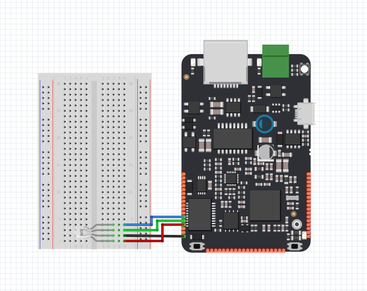
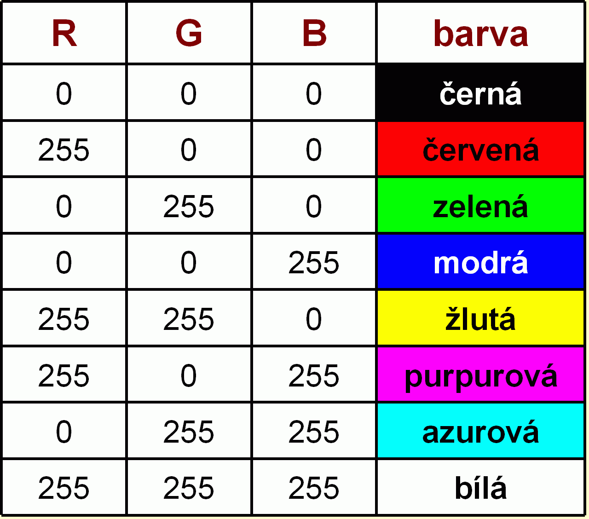

# BusOut

Tento program mění barvu RGB LED diody pomocí funkce `BusOut`. Barevný model RGB neboli červená-zelená-modrá je aditivní způsob míchání barev používaný v barevných monitorech a projektorech.

## Použitý hardware

* IODA
* 3x100Ω rezistor
* RGB LED
* nepájivé kontaktní pole

## Schéma zapojení 




### Funkce 

RGB LED \(red,blue,green\) je LED která mění svou barvu podle toho jaké napětí je na konkrétních pinech.



## Code

Ve funkci `void loop ()` se mění napětí na pinech\(Y01-Y03\) a tím i barva RGB LED .

```cpp
   /** BusOut 
     * in this example we shows how to change coulour of RGB LED.
     */

#include "byzance.h"   // Include libraries for IODA.
BusOut myleds(Y01,Y02,Y03);   //The BusOut interface is used to create a number of DigitalOut pins that can be written as one value.
Serial pc(SERIAL_TX, SERIAL_RX);   // Defines the comunication interface if the serial line , SPI, CAN is needen in the program.

void init(){
  pc.baud(115200);   // Set baud rate.
}
void loop(){
   // iterate over the pins:
   for(int i=0; i<16; i++) {
      myleds = i;
      Thread::wait(0.25);
   }
}
```


V hlavičce programu je nutné importovat knihovny [Byzance Hardware API](../../programovani-hw/byzance-api/) a [Mbed API](../../programovani-hw/mbed-api/). pomocí

```cpp
#include "byzance.h"
```

Poté nasledují dva konstruktory definující objekt [sériové linky](../komunikace-po-seriove-lince-uart-s-pc/) a objekt **bus** .  
Objekt **bus** definuje několik pinů najednou .

```cpp
Serial pc(SERIAL_TX, SERIAL_RX); 
BusOut myleds(Y01,Y02,Y03);   //The BusOut interface is used to create a number of DigitalOut pins that can be written as one value.
```

Při každém spuštění programu se nejprve provede funkce _**init\(\)**,_ která primárně slouží k inicializaci všech objektů a proměnných.V tomto programu pouze inicializujeme rychlost sériové linky.

```cpp
void init(){   // The init routine runs only once on the begin of the program
  pc.baud(115200);   // Set baud rate.
}
```

V hlavní smyčce _**loop\(\)**_ se měn napětí na pinech pomocí funkce for po 25ms .

```cpp
void loop(){
   // iterate over the pins:
   for(int i=0; i<16; i++) {
      myleds = i;
      Thread::wait(25);
   }
}
```

