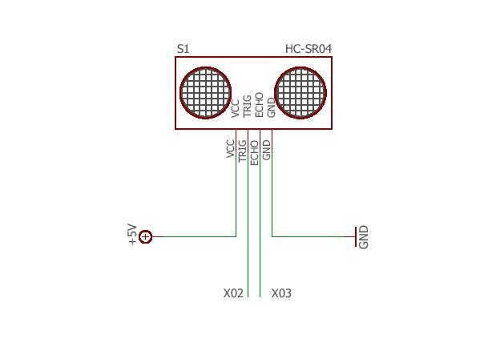
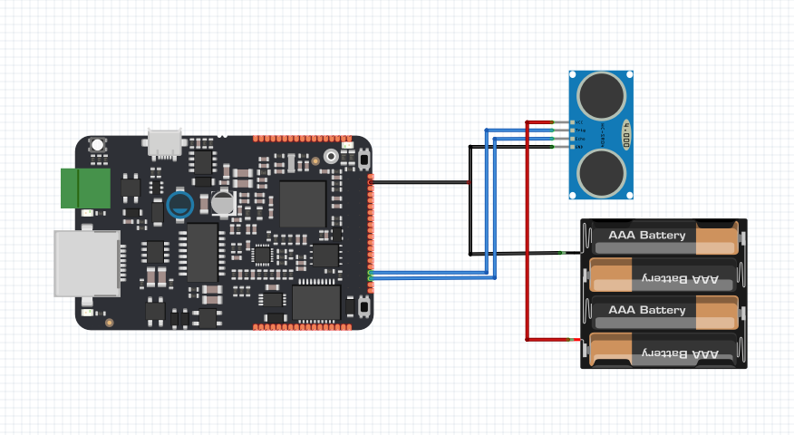

# HC-SR04 Senzor

Tento program slouží na měření vzdálenost pomocí ultrazvukového modulu HC-SR04. Jedná se o kompaktní modul o velikosti velikosti cca 44x20mm, který je již samostatně funkční a není již potřeba připojovat další součástky.

## Použitý hardware

* IODA
* HC-SR04
* piezo
* LED
* nepájivé kontaktní pole

## Schematické zapojení

### Zapojení konektorů Senzoru:

1. 5V Supply 
2. Trigger Pulse Input
3. Echo Pulse Output
4. GND. 

Trigger: spouštěcí signál impuls TTL\(5V\) &gt;10us

Echo: výstupní signál TTL\(5V\) -&gt; vzdálenost\[cm\] = doba\_Echo\[us\] \* 0.017315





### Funkce 

 Ultrazvukový snímač vyvolává vysokofrekvenční zvukové vlny a zachytáva echo, které je získane odrazem od překážky. V programu se počíta časový interval mezi vyslaným a přimutým signálem čím lze určit vzdálenost od objektu. 

## Code

Na začátu programu je potřeba definovat všechny pořebné proměnné a piny na které je připojený hardware.

 

```cpp
#include "byzance.h"

Serial pc(SERIAL_TX, SERIAL_RX);
DigitalOut trigger(X02);
DigitalIn  echo(X03);
Timer sonar;
int correction = 0;
int i;


void init(){
    pc.baud(115200);
}
void loop(){
    float distance = 0;
    float i=0;
    sonar.reset();
        sonar.start();
        while (echo==2) {};
        sonar.stop();
        trigger = 1;
        sonar.reset();
        wait_us(10.0);
        trigger = 0;
        while (echo==0) {};
        sonar.start();
        while (echo==1) {};
        sonar.stop();
        
        distance = (sonar.read_us())*0.017315;
        pc.printf("%f",distance);
        pc.printf("\n");
        wait(0.2);

    }
```

Po vyslání impulsu do modulu program počká na zpětné odeslání pulzu od modulu, kdy funkce Timer s názvem sonar nám vrátí potřebný počet mikrosekund.

```cpp
 sonar.reset();
        sonar.start();
        while (echo==2) {};
        sonar.stop();
        trigger = 1;
        sonar.reset();
        wait_us(10.0);
        trigger = 0;
        while (echo==0) {};
        sonar.start();
        while (echo==1) {};
        sonar.stop();
```

S tímto číslem můžeme dále pracovat. Vezmeme v úvahu rychlost zvuku 346,3 m\*s-1 a to při teplotě suchého vzduchu 25°C. To znamená, že za 1mikrosekundu urazí v metrech 346,3/1000000 což je 0,0003463 metru. Převedo na cm to je 0,03463cm/mikrosekundu. Vzhledem k tomu, že signál jde od čidla k předmětu, kde se odrazí a zase zpět, musíme tuto vzdálenost ještě vydělit číslem 2. Výsledek je takový že se vzdálenost bude rovnat počtem mikrosekund násobených číslem 0,017315. Výsledek zašleme na seriový port a uložíme ho do proměnné distance.

```cpp
 distance = (sonar.read_us())*0.017315;
```

Načtená hodnota se vypíše na seriovou linku 

```cpp
 pc.printf("%f",distance);
```

