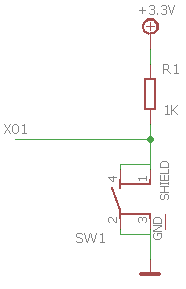
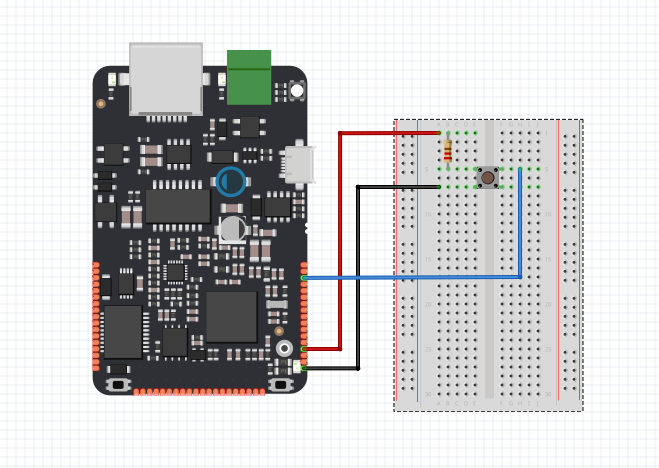

# State Change Detection

Provedení změny \(např. rozsvícení LED\) je závislé na tom, kolikrát stisknete tlačítko. Musíte vědět, kdy tlačítko změní stav z vypnuto na zapnuto a napočítat, kolikrát se tato změna stavu stane. Toto se nazývá detekce změny stavu. V tomto tutoriálu se dozvíme, jak kontrolovat změnu stavu, zasíláním zprávy sériovému monitoru s příslušnými informacemi. Např. napočítáme čtyři stavové změny pro zapnutí LED na desce.

## Použitý hardware

* IODA
* tlačítko
* LED
* 10kΩ rezistor
* kabely
* nepájivé kontaktní pole

## Schéma zapojení







### Funkce 

Stisknutím tlačítka, nebo přepínače se propojí dva body v obvodu. Když je tlačítko otevřeno \(není stisknuto\), nedojde k žádnému spojení mezi oběma kontakty tlačítka, takže kontakt je připojen k uzemnění \(pomocí pull-down\) a čte jako LOW nebo 0. Když je tlačítko zavřené \(stisknuto\), vytváří spojení mezi oběma kontakty, připojuje pin na 3.3 voltů tak, aby kontakt četl jako HIGH, nebo 1.

## Code


```cpp
#include "byzance.h"   // Include libraries for IODA
Serial pc(SERIAL_TX, SERIAL_RX);   // Defines the comunication interface if the serial line , SPI, CAN is needen in the program.
int buttonPushCounter = 0;   // counter for the number of button presse
int buttonState = 0;         // current state of the button
int lastButtonState = 0;     // previous state of the button
DigitalOut led(LED_RED);   // Set the digital out on pin X01
DigitalIn button(X01);   // Set the digital in on pinX00

void init(){   // The init routine runs only once when you press reset.
  pc.baud(115200);   // Set baud rate.
  Byzance::led_module(false);

}
void loop(){
  pc.printf("\n button: %d",button.read());   // Reads the button value and prints it.
  button.read();   // Read the button value.
  buttonState=button;   // Set the buttonState value from button
  if (buttonState != lastButtonState) {
      // if the state has changed, increment the counter
      if (buttonState == true) {
        // if the current state is true then the button went from off to on:
        buttonPushCounter++;
        pc.printf("\n on");   // Prints "on" on serial monitor.
        pc.printf("\n number of button pushes: ");   // Prints "number of button pushes:" on serial montor.
        pc.printf("\n %d",buttonPushCounter);   // Read buttonPushCounter value and prints it.
      } else {
        // if the current state is false then the button went from on to off:
        pc.printf("\n off");
      }
    }
    Thread::wait(50);
   lastButtonState = buttonState;   // Set the value from ButtonState to lastButtonState.
    // turns on the LED every four button pushes by checking the modulo of the
    // button push counter. the modulo function gives you the remainder of the
    // division of two numbers:
    if (buttonPushCounter % 4 == 0) {
      led = true;
    } else {
      led = false;
    }


}
```


V hlavičce programu je nutné importovat knihovny [Byzance Hardware API](../../programovani-hw/byzance-api/) a [Mbed API](../../programovani-hw/mbed-api/). pomocí

```cpp
#include "byzance.h"
```

Poté nasleduje několik  konstruktorů definující objekty [sériové linky](../komunikace-po-seriove-lince-uart-s-pc/) , proměnné a objekty [digitálního vstupu a výstupu](../../programovani-hw/mbed-api/vstupy-a-vystupy.md#vstupy-a-vystupy)

```cpp
Serial pc(SERIAL_TX, SERIAL_RX);   // Defines the comunication interface if the serial line , SPI, CAN is needen in the program.
int buttonPushCounter = 0;   // counter for the number of button presse
int buttonState = 0;         // current state of the button
int lastButtonState = 0;     // previous state of the button
DigitalOut led(LED_RED);   // Set the digital out on pin X01
DigitalIn button(X01);   // Set the digital in on pinX00
```


Při každém spuštění programu se nejprve provede funkce _**init\(\)**,_ která primárně slouží k inicializaci všech objektů a proměnných.Zde vypneme[ led modul](../../sprava-a-diagnostika/led-modul.md) a inicializujeme rychlost sériové linky.

```cpp
void init(){   // The init routine runs only once on the begin of the program
  pc.baud(115200);   // Set baud rate.
  Byzance::led_module(false);

}
```

V hlavní části programu _**loop\(\)**_ načítáme hodnotu tlačítka a vypisujeme jí na seriový monitor. Hodnotu tlačítka také zapisujeme do proměnné **buttonState**.

```cpp
pc.printf("\n button: %d",button.read());   // Reads the button value and prints it.
  button.read();   // Read the button value.
  buttonState=button;   // Set the buttonState value from button
```

V další části _**loop\(\)**_ počítáme kolikrát bylo tlačítko stisknuto. Také každé stisknutí vypisuje na seriový monitor.

```cpp
if (buttonState != lastButtonState) {
      // if the state has changed, increment the counter
      if (buttonState == true) {
        // if the current state is true then the button went from off to on:
        buttonPushCounter++;
        pc.printf("\n on");   // Prints "on" on serial monitor.
        pc.printf("\n number of button pushes: ");   // Prints "number of button pushes:" on serial montor.
        pc.printf("\n %d",buttonPushCounter);   // Read buttonPushCounter value and prints it.
      } else {
        // if the current state is false then the button went from on to off:
        pc.printf("\n off");
      }
    }
    Thread::wait(50);
   lastButtonState = buttonState;   // Set the value from ButtonState to lastButtonState.
    // turns on the LED every four button pushes by checking the modulo of the
    // button push counter. the modulo function gives you the remainder of the
    // division of two numbers:
```

Pokud je počet stisknutí dělitelný 4 **LED** se rozsvítí.

```cpp
    if (buttonPushCounter % 4 == 0) {
      led = true;
    } else {
      led = false;
    }
```

