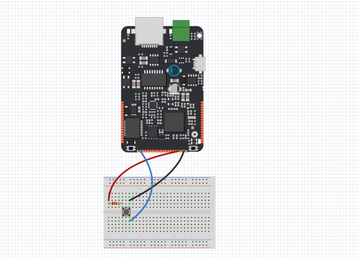

# Digital Read Serial

Tento příklad ukazuje, jak monitorovat stav stisknutí tlačítka přes sériovou linku mezi IODA a PC.

## Použitý hardware

* IODA 
* tlačítko
* kabely
* 10kΩ rezistor
* nepájivé kontaktní pole

## Schéma zapojení

Tlačítko SW1 připojíme mezi pin X01 a zem GND, dále připojíme pullup rezistor R1 o nominální hodnotě 10K mezi pin X01 a pin 3V3. 


## Schéma

Stisknutím tlačítka, nebo přepínače se propojí dva body v obvodu. Když je tlačítko otevřeno \(není stisknuto\), nedojde k žádnému spojení mezi oběma kontakty tlačítka, takže kontakt je připojen k uzemnění \(pomocí pull-down\) a čte jako LOW nebo 0. Když je tlačítko zavřené \(stisknuto\), vytváří spojení mezi oběma kontakty, připojuje pin na 3.3 voltů tak, aby kontakt četl jako HIGH, nebo 1.



## Code

### init\(\)

V první části programu se musí nastavit knihovny, seriová komunikace a vstup pinu X01. Ve funkci `init()` se nastaví modulační rychlost. Zbytek programu už probíhá ve funkci `loop()`.

### loop\(\)

První věc, kterou je potřeba provést v hlavní smyčce programu, je načíst hodnotu na pinu X01, přicházející z vašeho přepínače. Vzhledem k tomu, že informace přicházející z přepínače budou buď "1", nebo "0", není potřeba používat jiný datový typ než int.

```cpp
pc.printf("\n button value is : %d",button.read());
```


Tento příkaz načítá hodnotu tlačítka a nasledně ji vypíše na seriový monitor.

```cpp
  /**DigitalReadSerial
    * This example shows you how to monitor the state of a switch
    * by establishing serial communication between
    * IODA and your computer over USB.
    */

#include "byzance.h"   // include libraries for IODA
Serial pc(SERIAL_TX, SERIAL_RX);
DigitalIn button(X01);   // Set the analog pin.
void init(){   // The init routine runs only once when you press reset.
  pc.baud(115200);   // Set baud rate.
}
void loop(){   // the loop routine runs over and over agin forever:
  pc.printf("\n button value is : %d",button.read());   // Read button value and print it.
  Thread::wait(100);   // Wait for 1000ms.
}
```


