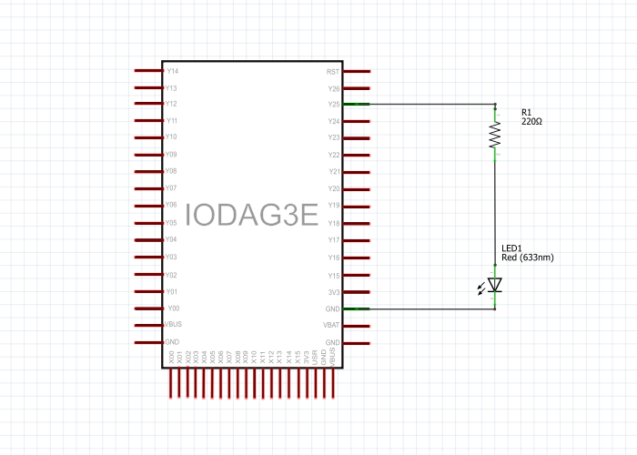

# Fade

Tento příklad demonstruje použití funkce PwmOut pro vypnutí a zapnutí LED. PwmOut využívá modulaci šířky impulzů \(PWM\), které velmi rychle zapíná a vypíná digitální pin s jiným poměrem mezi zapnutou a vypnutou částí, čímž se vytvoří efekt blednutí.

## Hardware

* IODA
* 220Ω rezistor
* LED
* kabely
* nepájivé kontaktní pole

## Obvod

Připojte anodu \(delší, pozitivní kontakt\) své LED na analogový výstupní pin Y25 na desce prostřednictvím 220 ohmového rezistoru. Připojte katodu \(kratší, záporný kontakt\) přímo k zemi.


## Schéma



## Code

Aby LED zhasla a zapnula se, postupně zvětšete hodnotu PWM z 0 \(úplně vypnuto\) na 1 \(zapnuto\) a pak znovu na 0, abyste cyklus dokončili. V náčrtu níže je hodnota PWM nastavena pomocí proměnné nazvané brightness. Pokaždé se přes smyčku zvyšuje o hodnotu proměnné fadeAmount.

Je-li proměnná brightness na jedné z koncových hodnot \(buď 0 nebo 1\), změní se fadeAmount na negativní. Jinými slovy, pokud je `fadeAmount=0,01;` pak je nastavena na -0,01. Pokud je hodnota `fadeAmount=-0,01;`, pak je nastavena na hodnotu 0,01.

```cpp
/**Fade
  *This example shows how to fade an LED on pin Y25 using the
  *PWM function.
  */
#include "byzance.h"   // Include libraries for IODA
Serial pc(SERIAL_TX, SERIAL_RX);   // Defines the comunication interface if the serial line , SPI, CAN is needen in the program.
PwmOut aout(Y25);   // Set pin Y25 for led.
void init(){   // The init routine runs only once when you press reset.
    pc.baud(115200);   // Set baud rate.
}
void loop(){   // The loop routine runs over and over agin forever

     for(float offset=0.0; offset<=1; offset+=0.01) {
        aout.write(0.005 + offset);
        wait(0.25);
     }
     
     for (float offset = 1.0 ; offset >= 0 ; offset -= 0.01) {
        pwm.write ( 0.005 + offset );
        wait ( 0.10 );
     }

}
```

