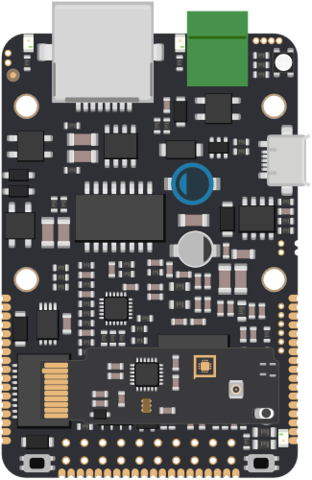

# Úvod



## Připojení napájení

Zařízení se automaticky spustí po připojení napájení. Zařízení lze napájet několika různými způsoby, které jsou zdokumentovány v [Harwarové specifikaci](../hardware/zakladni-jednotky/iodag3e/#moznosti-napajeni) v odstavci **Napájení**. Při prvním spuštění ovšem doporučujeme napájet zařízení pomocí kabelu micro USB ze zdroje s maximalním proudem alespoň 1000mA.


Po připojení USB kabelu lze pozorovat rozsvícení několika indikačních LED diod a pomalé blikání zelené diody LED modulu, které indikuje stav zařízení nepřipojeného k internetu.


## Připojení k portálu

Všechna zařízení Byzance jsou nakonfigurována již z výroby, tudíž pro komunikaci s Portálem stačí k zařízení již pouze připojit ethernetový kabel. Úspěšná komunikace je indikována rychlým blikáním LED modulu.


Pokud vše proběhlo úspěšně, zařízení je připraveno na [nahrání prvního programu.](nahrani-prvniho-programu.md)

Nastal-li jakýkoliv problém, zařízení jej může detekovat jedním z dalších možných blikacích kódů LED modulu.



## Přidání zařízení do projektu


1. klepnutím na ADD DEVICE otevřete diaglog pro přidání zařízení; následně zvolte Single Registration
2. vložte hash token z nálepky či QR kódu
3. klepnutím na ADD přidáte zařízení do projektu

## Vytvoření a uložení prvního programu

V záložce CODE &gt; CODE programs v projektu vytvořte program, který nazvěte například _test_. Klepnutím na program se otevře editor.

Do editoru můžeme vložit následující jednoduchý program, který vypisuje "Hello World!" přes USB emulátor sériového rozhraní:

```cpp
#include "byzance.h"
​
USBSerial usb(0x1f00, 0x2012, 0x0001, false);
​
void init(){
    // Hello world se vypise jednou pri startu
    usb.printf("Hello world from init function\n");
}
​
void loop(){
    // Hello world se bude vypisovat stale dokola kazdych 500 ms
    usb.printf("Hello World\n");
    Thread::wait(500);
}
```

Klepnutím na tlačítko BUILD se pokusíme zkompilovat tento program. Po úspěšné kompilaci vyskočí oznamovací bublina o úspěšné kompilaci.


Program uložíme.


1. klepnutím na SAVE vyvoláme dialogové okno
2. nazveme verzi - například _first version_
3. klepnutím na SAVE v diaglogovém okně vytvoříme verzi

## Nahrání programu do zařízení

V záložce HARDWARE klepneme na zařízení, které jsme předtím přidali do projektu.


1. v bloku BYZANCE CODE klepneme na tlačítko MANUAL CHANGE, čímž vyvoláme dialogové okno pro manuální změnu firmware vybraného zařízení
2. vybereme program dle názvu - v tomto případě tedy _test_
3. vybereme verzi programu k uploadu - v tomto případě _first version_

## Ověření funkčnosti

Zařízení vytvoří virtuální sériový port. Připojením na tento port pomocí terminálu zjistíme, zda zařízení odesílá požadovaný text do konzole.


## Závěr

Pokud je vše funkční, není nic snazšího než vyzkoušet nějaký z našich [tutoriálů](../tutorialy/), případně rovnou začít programovat s využitím [Byzance API](../programovani-hw/byzance-api/) anebo [mbed API](../programovani-hw/mbed-api/).

Pokud preferujete offline programování, je zapotřebí vlastnit nějaký programátor, nastavit vlastní IDE a další. Podrobnější popsi je možnéí najít v sekci offline programování.

