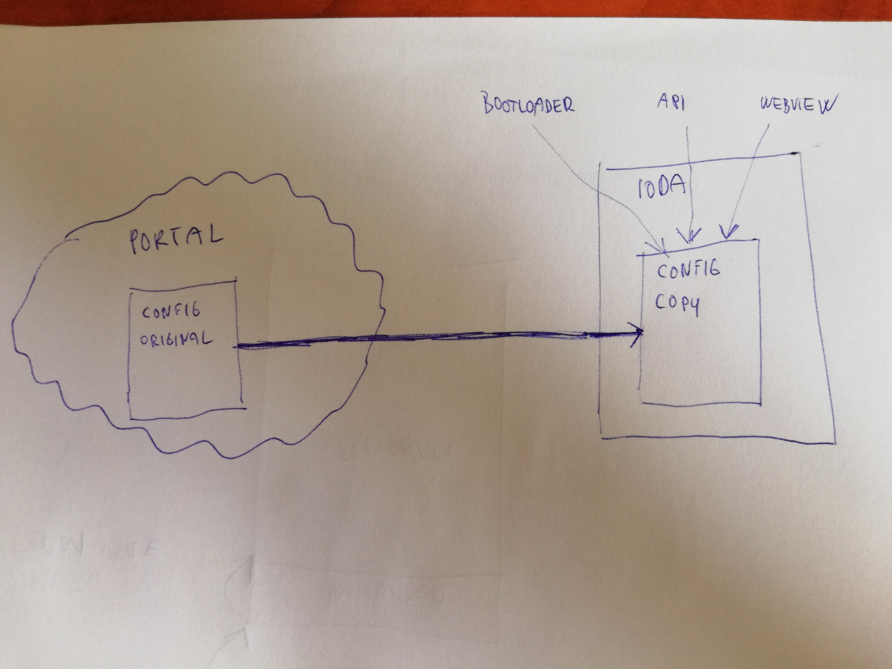
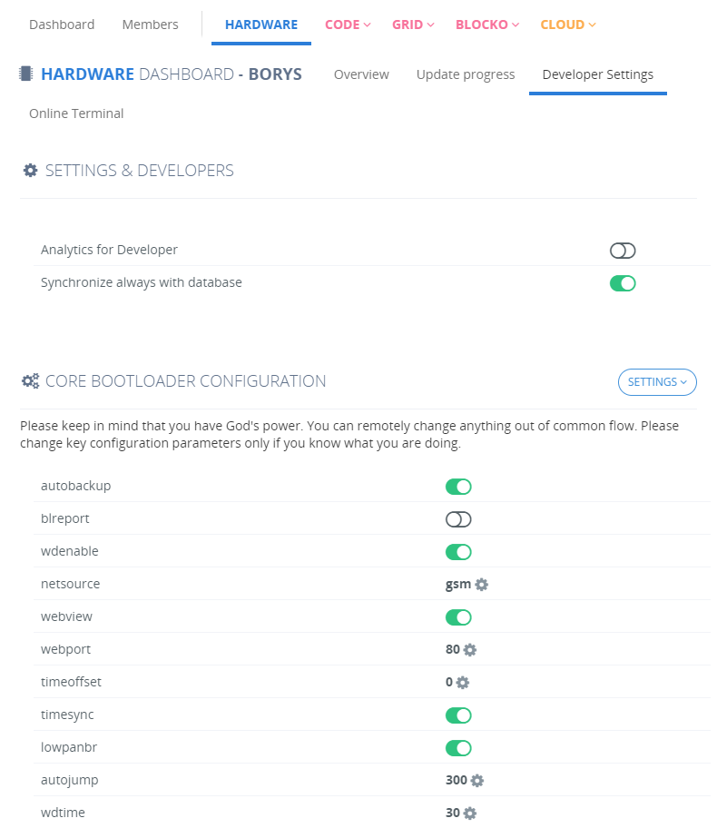

# Konfigurace zařízení

## Základní informace

Všechna zařízení IODAG3E jsou konfigurovatelná. Je-li třeba změnit výchozí konfiguraci, je třeba chápat synchronizační mechanismus a uvědomit si možné důsledky. Konfigurační parametry existují na dvou místech - online v Cloudu a offline v IODAG3E.

Dojde-li ke konfliktu mezi jednotlivými konfiguračními soubory, soubor v IODAG3E je při připojení k internetu automaticky přepsán konfigurací z Portálu. Proto je nutno konfiguraci provádět primárně z Portálu a ostatní metody brát jako doplňkové pro případ, že bude zařízení offline. 

## Konfigurace z Portálu

Preferovaný způsob při konfiguraci zařízení. 

## Konfigurace pomocí bootloaderu

[Bootloader ](../architektura-fw/bootloader/)je firmwarová komponenta \(zavaděč\). Spouští se jako první po startu zařízení a rozhoduje o tom, jestli dojde ke spuštění firmware, nebo vykoná některou se svých dalších možných funkcí. Jednou z těchto z těchto funkcí je [command režim](../architektura-fw/bootloader/command-mod.md), sloužící ke konfiguraci zařízení, pokud je offline. 

Konfigurace probíhá pomocí [sériové linky](../tutorialy/komunikace-po-seriove-lince-uart/#konfigurace-pc). Dojde-li ke konfliktu mezi nastavením provedeným z Bootloaderu a z Portálu, přednost má Portál a lokální nastavení v IODA je přepsáno. 

## Konfigurace z Byzance API

pokec

## Konfigurace z webového rozhraní

[Webové rozhraní](../funkcionality/webove-rozhrani/) IODAG3E \(webview\) je služba, která vznikla za účelem jednodušší kontroly zařízení, monitoringu a správu firmware. Pokud je webové rozhraní zapnuto a uživatel je i s IODAG3E na stejné síti \(platí pouze pro Ethernet\), je možné navštívit příslušnou URL požadovaného zařízení. 

Nutno brát v potaz, že lokálně provedené změny na IODAG3E mohou být přepsány Portálem při dalším připojení.

