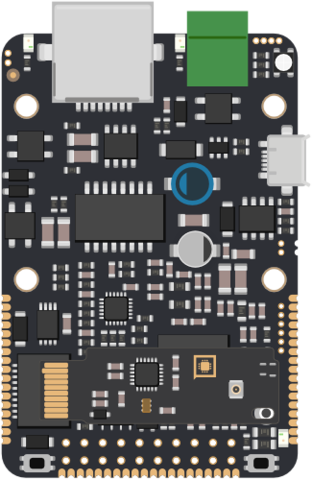
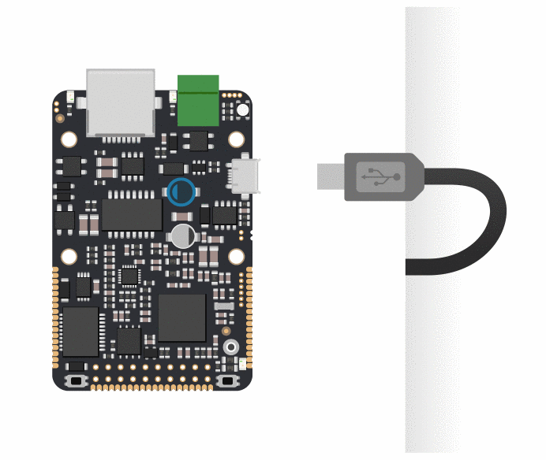
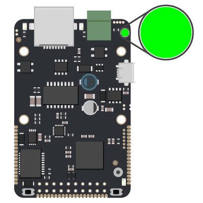

# Oživení zařízení

## Připojení napájení

Zařízení se automaticky spustí po připojení napájení. Zařízení lze napájet několika různými způsoby, které jsou zdokumentovány v [Harwarové specifikaci](../hardware/zakladni-jednotky/iodag3e/#moznosti-napajeni) v odstavci **Napájení**. Při prvním spuštění ovšem doporučujeme napájet zařízení pomocí kabelu micro USB ze zdroje s maximalním proudem alespoň 1000mA.

Po připojení USB kabelu lze pozorovat rozsvícení několika indikačních LED diod a  pomalé blikání zelené diody LED modulu, které indikuje stav zařízení nepřipojeného k internetu.

## Připojení k portálu

Všechna zařízení Byzance jsou nakonfigurována již z výroby, tudíž pro komunikaci s Portálem stačí k zařízení již pouze připojit ethernetový kabel. Úspěšná komunikace je indikována rychlým blikáním LED modulu.

Pokud vše proběhlo úspěšně, zařízení je připraveno na [nahrání prvního programu.](upload-prvniho-programu.md)

Nastal-li jakýkoliv problém, zařízení jej může detekovat jedním z dalších možných blikacích kódů LED modulu.



