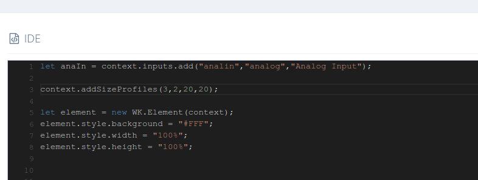
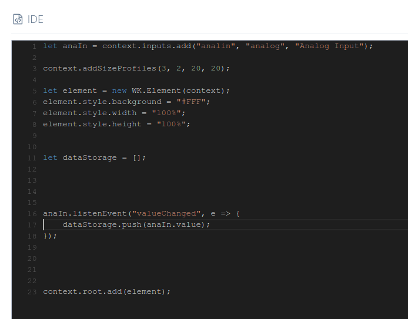
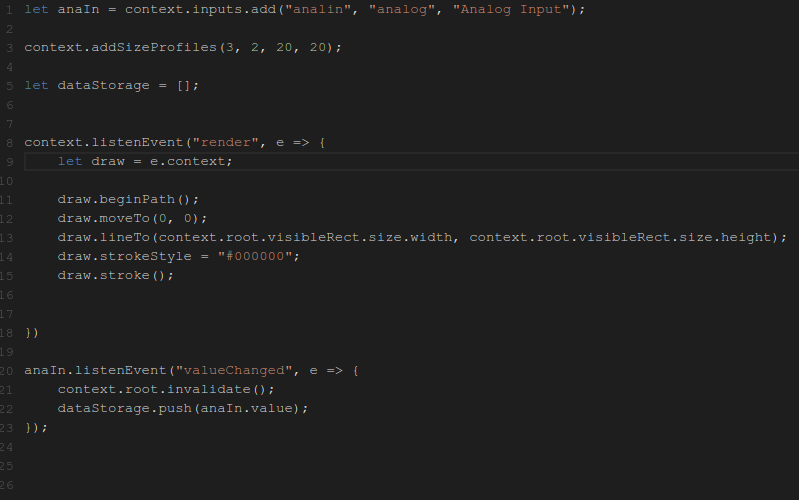
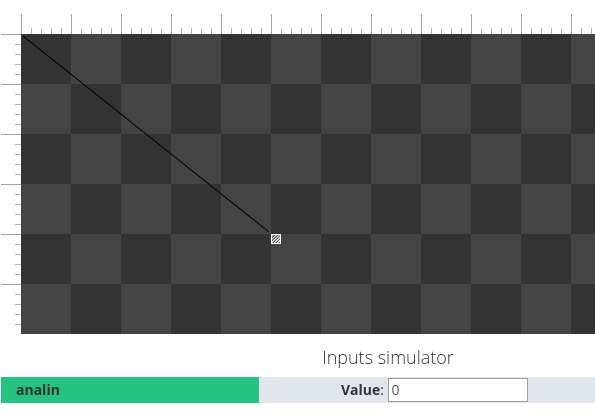
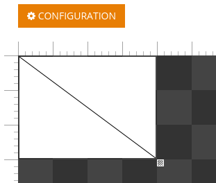
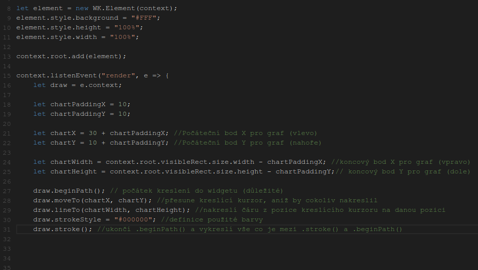
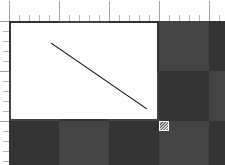
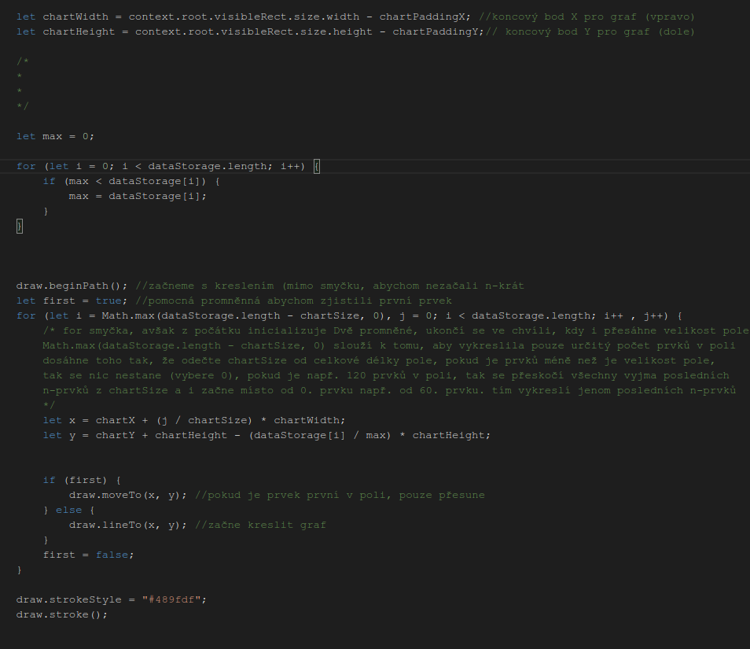
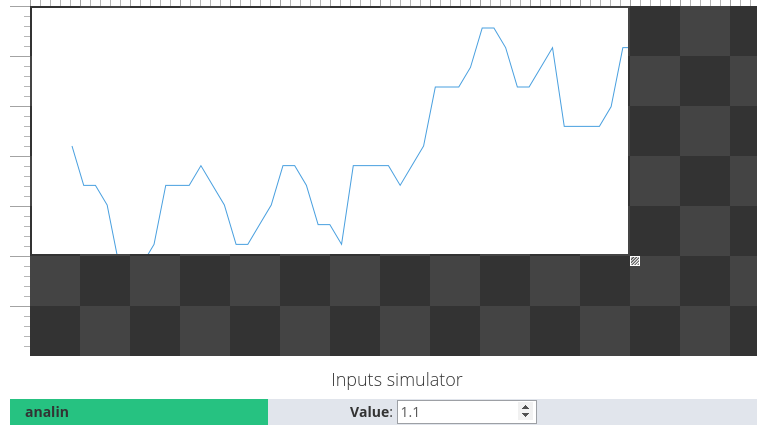
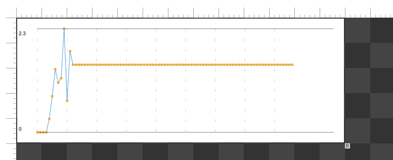

# graf \(pokročilé funkce GRID\)

Založíme si nový projekt a pojmenujeme si LineGraph.

## Úvodní kód:

vytvoříme Analogový vstup.  
Analog je reprezontován \(desetiným\) číslem. které může jít i do záporných hodnot.  
\(Poslední datový typ messeage, si ukážeme později.\)

```javascript
let anaIn = context.inputs.add("analin","analog","Analog Input");
```

a přidáme sizeProfile

```javascript
context.addSizeProfiles(3,2,20,20);
```

a nakonec přidáme "generický element", na kterém budeme pracovat.

```javascript
let element = new WK.Element(context);
```



Tímto jsme si vytvořili bílý obdélník jenž vyplňuje celou plochu widgetu.

### uchování hodnot:

Určitě budeme chtít zaznamenat hodnoty, které pak vykreslíme do widgetu jako graf. Proto si vytvoříme pole., do kterého si budeme ukládat hodnoty.  
\(připomínám, že pole v Javascriptu\(typescriptu\) fungují jinak než v Javě,C\(++/\#\) apod.\)

`let dataStorage = [];`

Nejlepší způsob, jak získat hodnotu z inputu je event listenerem. Proto napíšem

```javascript
anaIn.listenEvent("valueChanged", e => {        
    dataStorage.push(anaIn.value);      
});
```

**Pozn.:** kvůli bugu v GRID se nová hodnota nedá získat z callbacku \(e\).

tímto při každé změně uložíme novou hodnotu do pole.



Nyní je třeba začít s vykreslováním na element.

## Event render a kreslení

Widgety vykreslovány v Canvasu, díky tomu můžeme použít oficiální dokumentaci Canvasu. [\(LINK\). ](https://developer.mozilla.org/en-US/docs/Web/API/Canvas_API/Tutorial/Drawing_shapes)

Veškeré vykreslování se děje v

```javascript
context.listenEvent("render", e => {        
    let draw = e.context;    
})
```

čímž kreslíme na vrh celé "plochy" widgetu.  
Protože budeme hodně používat e.context, uložil jsem si ho do promněné pro jednodušší práci.

Ve zkratce nyní shrnu nejduležitější body z dokumentace Canvasu,

* Prakticky veškeré úkony s ním začínáme tím, že zavoláme metodu `.beginPath();`
* bod 0,0 se nachází v levém horním rohu
* veškeré změny projeví až poté co zavoláme `.stroke();`

Nakreslíme si základní testovací čáru.  
pod námi definovaný \_draw \_napíšeme

```javascript
draw.beginPath();  
 draw.moveTo(0,0);  
 draw.lineTo(context.root.visibleRect.size.width,context.root.visibleRect.size.height);  
 draw.strokeStyle = "#000000";  
 draw.stroke();`
```



a klikneme na **test**



Čára by vždy měla být z levého horního rohu do dolního pravého.  
Pozornější si jistě všimli `context.root.invalidate();`Tato metoda se volá kdykoliv se změní widget a je třeba znovu ho celý vykreslit \(znova zavolá render\).  
Např. při změně velikosti widgetu, nebo když ho zavoláme my s tím že chceme vykreslit nově příchozí hodnoty.

když už jsme dali dohromady základy práce s canvasem, jsem si udělat graf z hodnot co ukládáme do pole.

### více práce s kreslením

Pro snažší práci si zabarvíme pozadí na bílo a vytvoříme si několik promněných pro snažší práci.

Samozřejmě, přídáme si element, který jsme vytvořili na žačátku do widgetu.  
`context.root.add(element);`

nyní by při kliknuntí na test měla čára být nakreslená na bílém pozadí.



Na začátek renderu si nadefinujeme několik pomocných promněných.

začneme s

```javascript
let chartPaddingX = 10;  
let chartPaddingY = 10;
```

chceme nechat nějaký prostor na krajích.  
poté

```javascript
let chartX = 30 + chartPaddingX;  
let chartY = 10 + chartPaddingY;
```

jakožto "startovací bod" pro náš graf \(vlevo nahoře\). Odtud budeme začínat se vším vykreslováním.

nakonec

```javascript
let chartWidth = context.root.visibleRect.size.width - chartPaddingX  
let chartHeight = context.root.visibleRect.size.height - chartPaddingY;
```

Ve zkratce jsme si nadefinovali výšku a šířku pro náš widget, složením těchto dvou hodnot máme souřadnice pravého dolního rohu našeho grafu. U \_chartWidth \_jsme si vzali šířku celého widgetu \(která může být různě veliká\) a odečetli jsme od ní padding \(pro odstup od okraje\).

Abychom zhruba věděli, jak je náš Graf ve widgetu velký, změníme několik parametrů v naší předtím vytvořené čáry.

změníme

```javascript
draw.moveTo(0,0);  
 draw.lineTo(context.root.visibleRect.size.width,context.root.visibleRect.size.height);
```

na

```javascript
 draw.moveTo(chartX, chartY);  
 draw.lineTo(chartWidth, chartHeight);
```



klikneme na test a podíváme se, zda se všechno povedlo dle plánu.



### zakreslování hodnot

Poté, co jsme si oveřili že vše vypadá OK, mohli bychom získat data z našeho pole, a zakreslit je do widgetu.  
to uděláme smyčkou\(loop\).

nejdříve najdeme nejvyšší hodnotu v poli, což uděláme jednoduše:

```javascript
let max = 0;  
    for (let i = 0; i < dataStorage.length; i++) {  
        if (max < dataStorage[i]) {  
            max = dataStorage[i];  
        }  
    }
```

vytvoříme promněnou, kterou budeme určovat počet prvků jenž zobrazíme v grafu

`let chartSize = 50;`

poté napíšeme smyčku na vykreslování grafu jako takového:

```text
render.beginPath();
let first = true;  
    for (let i = Math.max(dataStorage.length - chartSize, 0), j = 0; i < dataStorage.length; i++ , j++) {  
        const x = chartX + (j / chartSize) * chartWidth;  
        const y = chartY + chartHeight - (dataStorage[i] / max) * chartHeight;
        if (first) {
             draw.moveTo(x, y);
         } 
        else { 
             draw.lineTo(x, y);
         }
    first = false;    
    }
draw.strokeStyle = "#489fdf";  
draw.stroke();`
```



## překreslení hodnot \(re-render\)

To nejdůležitější je hotovo. Pokud jste ještě nedopsali to, že při změně hodnoty se má překreslit widget, nyní je správná chvíle

```javascript
anaIn.listenEvent("valueChanged", e => {
    context.root.invalidate();
    dataStorage.push(anaIn.value);
});
```

\`

a můžeme náš widget otestovat.



widget by měl při každé změně hodnoty nakreslit nový graf, který se postupně posouvá.

## Vodící čáry grafu:

Avšak, graf bez hodnot je užitečný jako bezdrátová myš bez baterek.  
Přidáme text a "vodící čáry'

```javascript
draw.fillStyle = "#000";
draw.fillText("0", 3, chartY + chartHeight - 3);
draw.fillText(max, 3, chartY + 13);
draw.strokeStyle = "rgba(0,0,0,0.5)";

draw.beginPath();
draw.moveTo(chartX, chartY);
draw.lineTo(chartX + chartWidth, chartY);
draw.stroke();

draw.beginPath();
draw.moveTo(chartX, chartY + chartHeight);
draw.lineTo(chartX + chartWidth, chartY + chartHeight);
draw.stroke();
```

Zároveň, můžeme přidat i to, že se vykreslí "kolečka" na vrcholech. první část kódu známe

```javascript
 for(let i = Math.max(dataStorage.length - chartSize, 0), j = 0; i < dataStorage.length; i++, j++) {
        const x = chartX + (j / chartSize) * chartWidth;
        const y = chartY + chartHeight - (dataStorage[i] / max) * chartHeight;
        draw.beginPath();
        draw.arc(x,y,2,0,2*Math.PI); //nakreslí oblouk o poloměru Pí * 2 radiánů (celý kruh)
        draw.closePath();
        draw.strokeStyle = "rgb(0, 153, 255)";
        draw.stroke();
        draw.fillStyle = "rgba(0, 153, 255, 0.5)";
        draw.fill();
    }
```

### změna četnosti vykreslování

Pokud se zamyslíme tak zjistíme, že se hodnoty do grafu vykreslují ve chvíli, kdy se změní hodnota vstupu, což je poněkud k ničemu.

Vytvoříme si interval, který bude pravidělně číst a zapisovat do grafu:

```javascript
setInterval(function () {
    dataStorage.push(input.value); //přidáme hodnotu do pole
    context.root.invalidate(); //překreslíme widget
}, 1000);
```

a listener smažeme, protože nechceme nadále zapisovat hodnoty pouze při změně, ale pravidelně

```javascript
input.listenEvent("valueChanged", function (e) {});
```

výsledný graf bude vypadat nějak takto 



Pokud jste s grafem spokojeni. Můžete ho vesele používat kde potřebujete.

### konečné slovo:

Samozřejmě je zde hromada místa k zlepšení, jako např. možnost ukazovat více čar, možnost zobrazovat i čísla pod nulu...

