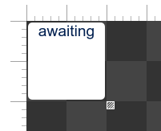
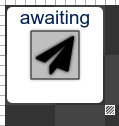
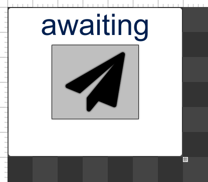

# text generátor button \(messeage type, two elements one widget\)

Jednoho dne se stane, že si budeme chtít zobrazit či posílat text, protože né vše se dá vyjádřit v číslech.

## myšlenka:

Pro pozdější užití, veškeré možnosti co můžeme dostat do "messeage" jsou:

```javascript
let textOutput = context.inputs.add("textMsgOut","message","text sender",["string","float","boolean","integer"]);
```

Ale protentokrát si vystačíme jenom se string.

V tomto návodu si uděláme tlačítko, které přijme hodnotu, ukáže jí, a při kliknutí na něj pošle jeho upravenou hodnotu  
Založíme si nový Widget a pojmenujeme ho např **text display/sender.**

## Úvodní řádky kódu:

Začneme se vstupem a výstupem

```javascript
let textInput = context.inputs.add("textMsgIn", "message", "text input", ["string"]);
let textOutput = context.outputs.add("textMsgOut", "message", "text output", ["string"]);
```

Messeage type je poněkud specifická, a to tím, že je třeba jako poslední argument vypsat do pole všechny hodnoty co se budou posílat. \(seznam všech možných hodnot je vypsán výše\). Počet prvků v poli by měl být dostatečný pro všechny případy.

Nesmíme samozřejmě zapomenout na `sizeProfiles`

```javascript
context.addSizeProfiles(2, 2, 10, 10);
```

Protože v tomto návodu chci složit Widget ze dvou elementů, kterům budu nastavovat barvu, připravím si configProperities

```javascript
let bcColor = context.configProperties.add("backElementColor", "color", "color of backgrnd element", "#FFFFFF");
let bcTextColor = context.configProperties.add("backElementTextColor", "color", "color of backgrnd text", "#001F4F");

let fcColor = context.configProperties.add("frontElementColor", "color", "color of front element", "#BFBFBF");
let fcTextColor = context.configProperties.add("frontElementIconColor", "color", "color of icon", "#000000");

let fcIcon = context.configProperties.add("Icon", "fa-icon", "Icon", "fa-paper-plane");
```

## background element a jeho stylyzace

přidáme "background" alement, na kterém budeme vykreslovat přijatý text \(a později na něj dáme tlačítko\)

```javascript
let backPan = new WK.Label(context, "awaiting");
```

nastylujeme ho a přidáme

```javascript
backPan.style.background = bcColor.value; //z config property
backPan.style.color = bcTextColor.value; 

backPan.style.fontSize = "22"; 
backPan.style.horizontalAlign = "center";
backPan.style.verticalAlign = "top"; //text chceme vykreslovat nad tlačítkem

backPan.style.width = "100%";
backPan.style.height = "100%";
backPan.style.radius = "5"; //zakulatíme rohy elementu, vyšší číslo = vyšší kulatost

context.root.add(backPan);
```

Při testu dostaneme něco takového:



## tlačítko \(vrchní element\) a jeho stylizace:

Nyní přidáme druhý element, tlačítko. Postup je pořád stejný

```javascript
let button = new WK.Button(context, "[fa]" + fcIcon.value + "[/]");

button.style.background = fcColor.value;
button.style.color = fcTextColor.value;

button.style.fontSize = "18";
button.style.horizontalAlign = "center";
button.style.lineHeight = "100vh";

button.style.originX = "0.5"; //tímto nastavíme aby se element vytvořil "uprostřed"
button.style.originY = "0.5";
button.style.x = "50%"; //tímto element posuneme tak, aby byl opravdu ve středu
button.style.y = "50%";

button.style.width = "50%"; 
button.style.height = "50%";

button.style.border = "#121212 1px"; //nastavení "ohraničení" elementu, první hodnota jest barva, druhá tloušťka

context.root.add(button);
```

Pokud teď klikneme na test, uzřeme něco podobného tomuto



### interaktivita:

Pokud ale změníme cokoliv v c_onfiguration_, nic se nestane. Proto přidáme event-listener na změny v nastavení

```javascript
context.configProperties.listenEvent("valueChanged", e => {
    backPan.style.background = bcColor.value;
    backPan.style.color = bcTextColor.value;
    button.style.background = fcColor.value;
    button.style.color = fcTextColor.value;
    button.text = "[fa]" + fcIcon.value + "[/]";
});
```

Toto při každé změně v configu, aktualizuje všechny hodnoty. Mužeme samozřejmě poslouchat jednotlivé configy a pravovat pouze tu danou hodnotu, co se změní, např.

```javascript
bcColor.listenEvent("valueChanged", e=>{
    backPan.style.background = bcColor.value;
})
```

#### změna velikosti textu apod.:

Doděláme zbytek drobností jako například dynamickou velikost textu a prostřední ikony:

```javascript
backPan.listenEvent("resize", e => {
    backPan.style.fontSize = (backPan.visibleRect.size.height * 0.20) + "px";
});
```

U backPan měníme velikost textu na dvacet procent výšky celého backPan, kvůli tomu, že máme ještě tlačítko uprostřed, jenž by zakrylo text.

```javascript
button.listenEvent("resize", e => {
    button.style.fontSize = button.visibleRect.size.height * 0.8 + "px";
});
```

Připomínám, že **visibleRect vrací údaje v pixelech**.

Výhodou Resize je že se automaticky zavolá při spuštění testu.

Tlačítko by nyní mělo být schopno měnit velikost textu a ikonky, dle naší vůle



## interakce s uživatelem:

Vrhneme se na poslední část, Interaktivitu s uživatelem.

Nejprve začneme měnit text dle vstupu, samozřejmě čím jiným, než listenerem

```javascript
textInput.listenEvent("messageReceived", e => {
    backPan.text = e.message.values[0];
});
```

S messeage pracujeme jako s polem, pořadí jsme si určili již na začátku v posledním argumentu v input/output. Protože víme, že první věc v poli je string \(a pouze string\), rovnou si ho vypíšeme.

Ještě přidáme to, že při kliknutí na **tlačítko uprostřed **pošleme poslední zprávu co nám přišla z inputu a přidáme k ní text.

```javascript
button.listenEvent("mousedown", e => {
    if (button.isHover) {
        let text = "";
        text += textInput.lastMessage.values[0]; //https://youtrack.byzance.cz/youtrack/issue/GRID-25
        text += ".Byz";
    }
});
```

button.isHover kontroluje, zda je kurzor opravdu nad daným elementem, bez něj reaguje automaticky na mouse.down.  
**TODO: kvůli chybě v gridu je teďka zapotřebí si v listeneru "messeageRecived" uložit bokem získaný objekt pro pozdější práci s ním**

## závěr:

Klikneme na test a otestujeme tlačitko na všechny způsoby.

