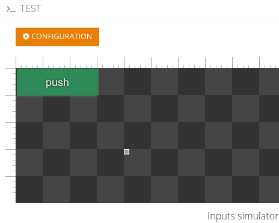
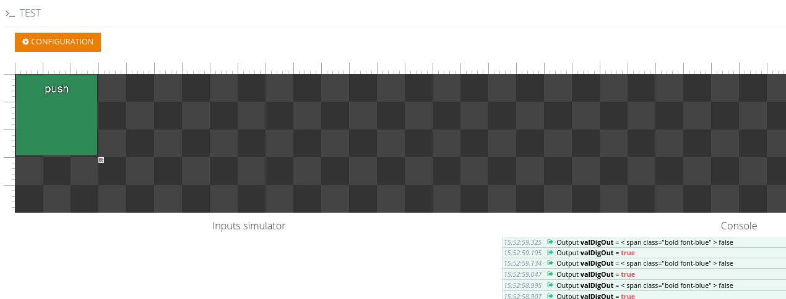

# Základní Tlačítko \(základy GRID\)

## vytvoření projektu

Jakožto první příklad si vytvoříme jednoduché tlačítko, které při stisknutí pošle digitální hodnotu `true`a při puštění `false`

začneme novým, čistým widgetem:


vybereme nebo vytvoříme novou skupinu, dle toho kam chceme widget


a stiskneme "create new grid widget"


vytvoříme widget a otevřeme ho: 


## Programová část:

Nejdříve se zamyslíme nad tím, co chceme aby náš widget dělal a co vše k tomu bude potřebovat.  
Naše tlačítko bude reagovat na stisk tím, že pošle signál že je stisknuto.  
Naše tlačítko nic nepříjímá, pouze posílá jednu boolean hodnotu.

Tudíž nám stačí jeden output, vzhledem k tomu že se jedná o boolean, jenž pouze nabývá hodnot true/false, tak nám stačí digitální výstup.

**Pozn.:** Z praktického hlediska vždy začínáme s psaním input/output na začátku.

protože píšeme v jazyku Typescript, začneme takto  
`let valueDigOutput = context.outputs.add("valDigOut","digital","value digital out");`  
kde první argument označuje **jednoslovně** jméno výstupu \(pro práci v blocku\), druhý **typ výstupu** \(digital, analog, messeage\), o těch si povíme později, a poslední je popisné pojmenování jenž se zobrazí v nastavení u nastavení.

let 

`valueDigOutput`

definuje promněnou abychom mohli k daménu outputu přistupovat v kódu 


Poté definujeme rozměry widgetu, **definice rozměrů je povinná ve všech widgetech.    
**Můžeme použít  
`context.addSizeProfile(1,1);`kde v parametrech definujeme výšku a šířku widgetu \(v pevně daných čtvercích, tudíž widgety vypadají všude stejně. Jeden čtverec má zhruba 1 cm\).

Tímto definujeme velikost napevno, bez možností jí změnit.

Pokud víme, že budeme tento widget při tvoření aplikace zvětšovat, můžeme použít  
`context.addSizeProfiles(1,1,5,5);`

pořadí parametrů jest 

\(

minimální výška, minimální šířka, max. výška, max. šířka

\)

;

Tímto přidáme rozsah možných velikostí.


Size profilů může být přidáno vícero, bloček začne vždy od nejmenší možné velikosti.  
Přidáváním síze profilů přidáváme povolené \(možné\) rozměry widgetu.

připomínám že \*\*Musíme přidat jakýkoliv kladný a nenulový sizeProfile každému widgetu.

**Pokud kliknete na **

_**test**_

**, zobrazí se toto:**


**Protože ačkoliv máme definované velikosti, **

nemáme definované jakékoliv grafické prvky

\*

\*

. Musíme je do Widgetu přidat.

### Přidání grafického elementu:

Protože Widgety jsou od toho, abychom poskytnuli uživateli grafickou vazbu na jeho zařízení, musíme je do Widgetu přidat.

Přidáme jednoduchý _button_ element, z WK objektů

```javascript
let button = new WK.Button(context,"push");
```


první argument je vždy context 

\(

později si ukážeme, proč

\)

 a druhý je text v našem tlačítku.

Pokud znovu klikneme na _test_, nic se nestane, protože tlačítko nená ani styl a ani není přidané do Widgetu.

pro přidání tlačítka do Widgetu použijeme

```javascript
context.root.add(button);
```


prvný argument je element, který přidáváme.

Root můžeme považovat za 

**základní **

element, který je rozšířen o několik funkcionalit a je přítomný vždy ve všech widgetech.

Klikneme na tlačítko 

_test. _


pokud si tlačítko zvětšíme, zjistíme že je defalutně nastylované, avšak vzhedově je naprosto ošklivé.



### Základní stylizace

Upravíme si tlačítko tak, aby bylo po celé šířce i výšce našeho widgetu.  
Připomínám, že widgetů budeme mít v aplikaci několik a jeden widget by měl zastávat jednu funkci.

Úprava stylu elementu je jednoduchá. Šířku a výšku \_button \_elementu upravíme snadno pomocí

```javascript
button.style.height = "100%";
button.style.width = "100%";
```

\`


Pokud dáme _test_ ihned uvidíme zlepšení.


Rosáhlejší stylování popíšeme později, pro rychlé nahlédnutí ale pomůže kapitola "[Styly a jejich použití](styly-a-jejich-pouziti.md)".

### Interakce s uživatelem

O interaktivní stránku widgetů se nejčastěji používají listenery.  
Na náš \_button \_přidáme event listener, který bude naslouchat zda bylo na tlačítko kliknuto.

```javascript
button.listenEvent("mousedown", callback => {        
     valueDigOutput.value = true;        
 });
```

na _button_ zavoláme listenEvent, první argument je typ akce, na kterou má kód reagovat \(v tomto případě, že na element bylo zmáčknuto tlačítko myši\) a další část je funkce, co se má vykonat při vyvolání. Jedná se o zkrácený javascriptový zápis

```javascript
button.listenEvent("mousedown", function(callback){        
     valueDigOutput.value = true;        
 });
```

\(obojí je validní\)  
kde \_callback \_je pouze pomocná promněná a můžeme jí pojmenovat jak je libo.

V hranatých závorkách je kód, co se vykoná při stisknutí levého tlačítka na myši ve chvíli co je najet na button element.  
V kódu voláme na záčátku definovaný _valueDigOutput \_jakožto výstup.  
Protože se jedná o digitální výstup, vkládáme do .value jenom \_true_ nebo _false._  
v tomto případě posíláme true \(logickou 1\);

přidáme ještě:

```javascript
button.listenEvent("mouseup", e => {        
     valueDigOutput.value = false;        
 });
```

Což při puštění tlačítka myši pošle na výstup _false_

Nyní klikneme na 

_test_



A mužeme testovat, pokud vše proběhlo správně, do konzole se vypisuje stav valDigOut.

## Gratuluji, tímto jste vytvořili základní tlačítko pro uživatele

